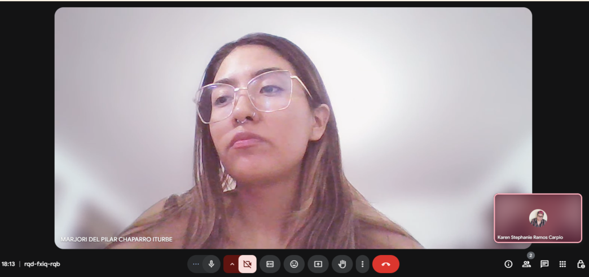
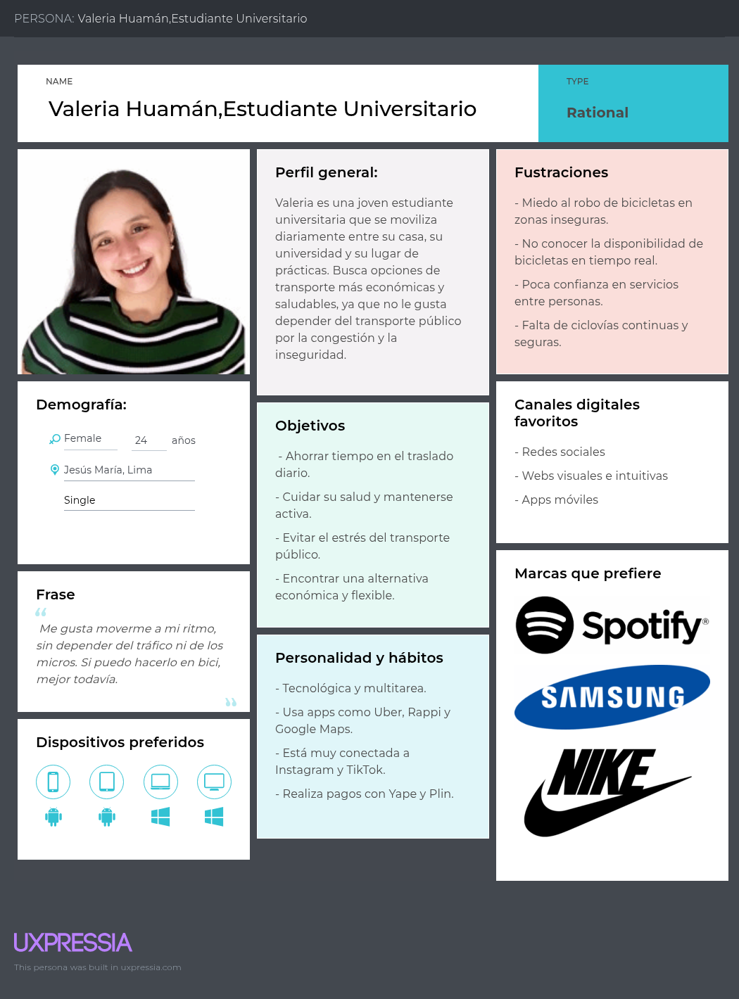
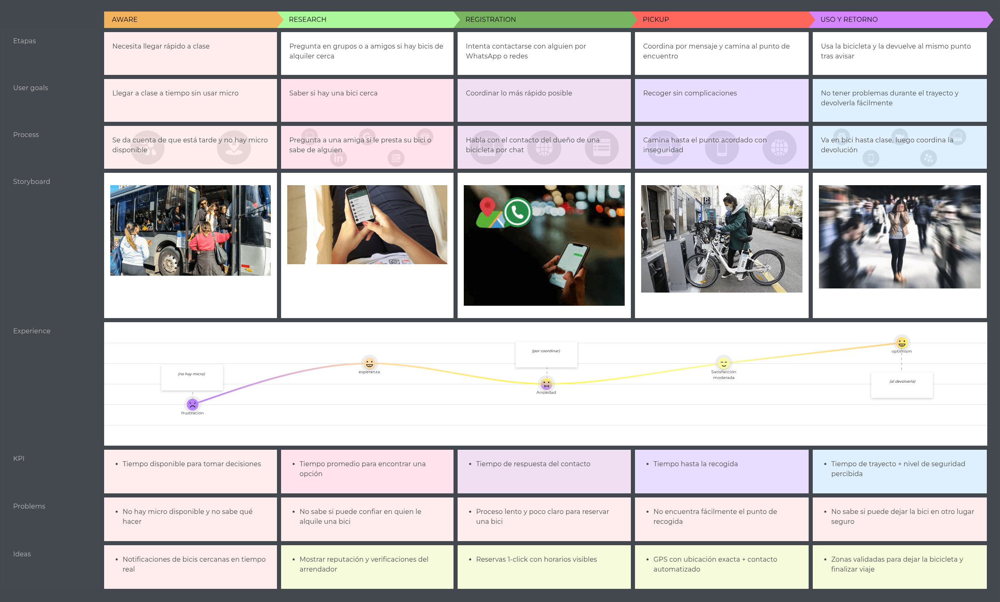
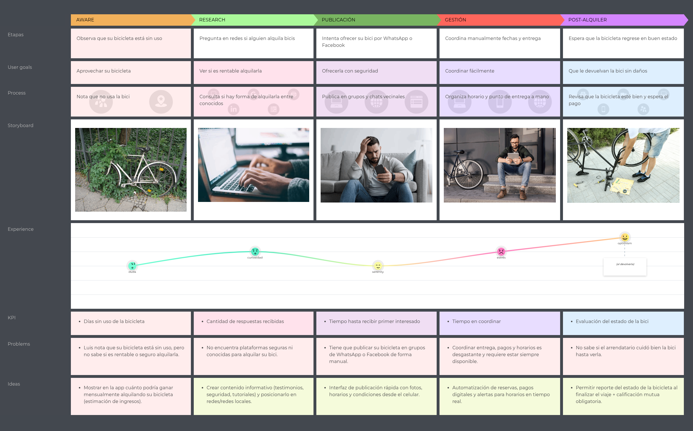
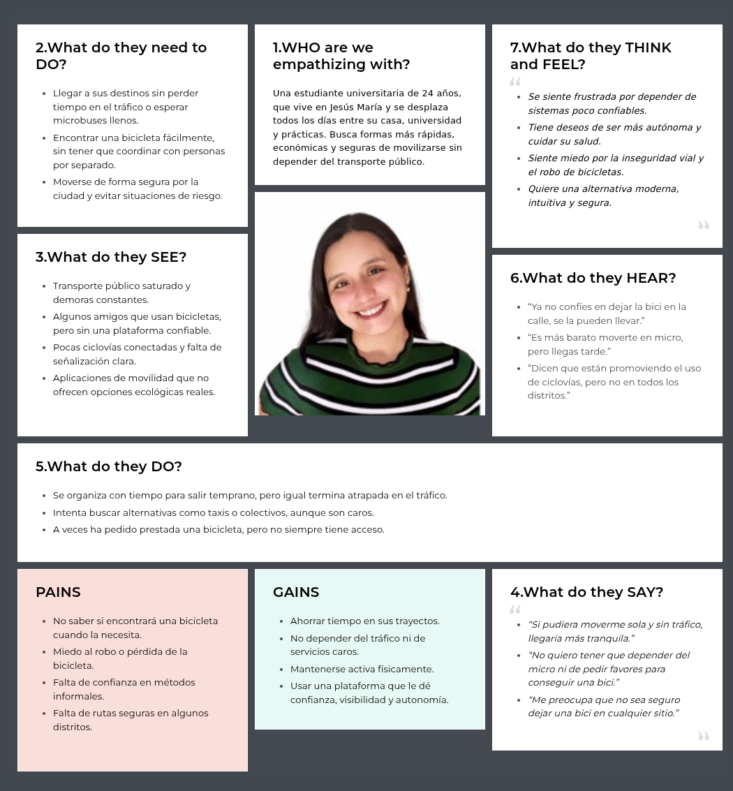
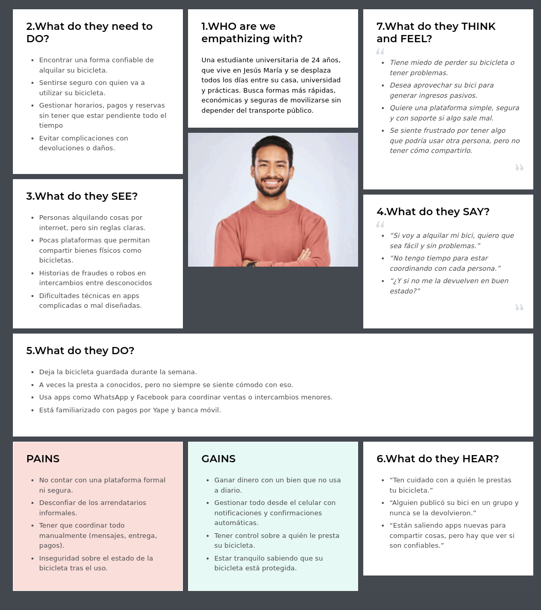
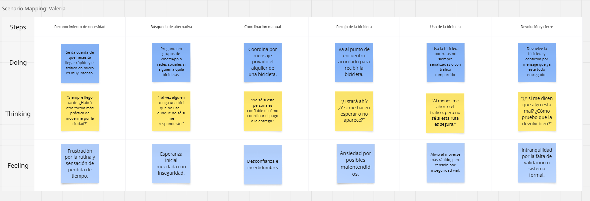
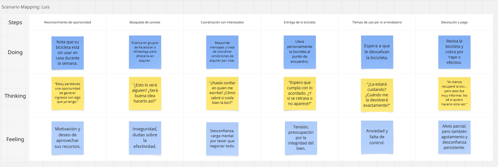

### [Capítulo II: Requirements Elicitation & Analysis]()
- [2.1. Competidores]()
  - [2.1.1. Análisis competitivo]()

    **¿Por qué llevar a cabo este análisis?**  
    Este análisis permite conocer mejor a los competidores actuales en el sector de alquiler de bicicletas en Lima Metropolitana, identificar sus fortalezas y debilidades, y establecer estrategias efectivas para que BikeShare se posicione con ventaja competitiva en el mercado local.

    | **Categoría** | **BikeShare**  | **CityBike Lima**  | **Bicilandia**  | **Barranco Bikes**  |
    |---------------|---------------|-------------------|----------------|---------------------|
    | **Overview** | Plataforma colaborativa digital para alquiler de bicicletas entre ciudadanos en Lima Metropolitana. | Sistema de bicicletas públicas con estaciones fijas en Miraflores. | Alquiler tradicional de bicicletas desde locales físicos en zonas turísticas. | Alquiler de bicicletas y tours guiados con servicio de entrega a domicilio. |
    | **Ventaja competitiva** ¿Qué valor ofrece a los clientes? | Fomenta la economía colaborativa, acceso flexible y sin estaciones físicas, geolocalización y pagos integrados. | Conveniencia, integración con infraestructura urbana, tecnología móvil. | Accesibilidad y bajo costo para turistas sin tecnología. | Enfoque turístico personalizado y servicio de entrega. |
    | **Mercado objetivo** | Jóvenes, estudiantes, trabajadores urbanos, 18-40 años, con conciencia ecológica. | Residentes y visitantes de Miraflores. | Turistas y visitantes temporales. | Turistas y residentes recreativos en Barranco. |
    | **Estrategias de marketing** | Campañas digitales, redes sociales, alianzas con universidades y colectivos ciclistas. | Promoción local, presencia visual en espacios públicos. | Promociones físicas y boca a boca, descuentos estudiantiles. | Presencia en redes, contacto directo, convenios turísticos. |
    | **Productos & Servicios** | Alquiler entre usuarios, reservas, pagos online, historial y sistema de reputación. | Bicicletas propias con estaciones automatizadas. | Bicicletas mecánicas sin reservas ni tecnología. | Alquiler, tours, clases de surf con entrega de bicis. |
    | **Precios & Costos** | Microtransacción (~10%) por alquiler, con planes premium futuros. | Tarifas por pase diario, mensual y anual con tiempo limitado por viaje. | Precio por hora, con promociones para estudiantes. | Costos por horas/tours, según actividad contratada. |
    | **Canales de distribución (Web/Móvil)** | Web app accesible desde cualquier navegador con conexión. | App móvil para registro y desbloqueo de bicicletas. | Presencial, sin canal digital. | Redes sociales, WhatsApp y reservas por teléfono. |
    | **Fortalezas** | Escalable, sin flota propia, promueve comunidad y sostenibilidad. | Infraestructura consolidada, operación fluida. | Costo operativo bajo, fácil acceso local. | Atención personalizada, nicho turístico. |
    | **Debilidades** | Base de usuarios aún en construcción, requiere confianza entre pares. | Cobertura limitada a un distrito, dependencia de estaciones. | Sin escalabilidad, sin presencia digital. | Cobertura limitada y sin plataforma digital robusta. |
    | **Oportunidades** | Impulso municipal al ciclismo, tendencia ecológica urbana. | Iniciativas distritales en transporte ecológico. | Turismo activo en Miraflores y Jesús María. | Turismo recreativo y cultural en Barranco. |
    | **Amenazas** | Competencia con apps ya establecidas, resistencia inicial de usuarios. | Limitado potencial de expansión sin inversión en estaciones. | Perder mercado ante plataformas tecnológicas. | Falta de escalabilidad y dependencia de comunicación directa. |

  - [2.1.2. Estrategias y tácticas frente a competidores]()
    
    BikeShare, al operar en un mercado donde ya existen soluciones tradicionales y semi-digitales de alquiler de bicicletas, debe aplicar estrategias que le permitan posicionarse como una alternativa innovadora, segura y sostenible. A continuación, se detallan las estrategias y tácticas            preliminares para afrontar las fortalezas y debilidades de los competidores, así como para aprovechar las oportunidades y mitigar las amenazas presentes en el entorno competitivo.

#### Frente a las fortalezas de los competidores

| **Fortalezas de los competidores**                                                                 | **Estrategias de BikeShare**                                                                                     |
|----------------------------------------------------------------------------------------------------|------------------------------------------------------------------------------------------------------------------|
| CityBike Lima cuenta con infraestructura consolidada y estaciones automatizadas.                  | Diferenciación mediante un modelo sin estaciones fijas, que permita flexibilidad en el retiro y entrega de bicicletas. |
| Bicilandia ofrece precios accesibles y presencia en zonas turísticas.                              | Implementar tarifas dinámicas y descuentos por uso frecuente, con un sistema de pago transparente.               |
| Barranco Bikes brinda atención personalizada y tours guiados.                                      | Establecer alianzas con guías locales y operadores turísticos para integrar experiencias dentro de la plataforma. |

#### Frente a las debilidades de los competidores

| **Debilidades de los competidores**                                                                | **Tácticas de BikeShare**                                                                                          |
|----------------------------------------------------------------------------------------------------|--------------------------------------------------------------------------------------------------------------------|
| Cobertura geográfica limitada a ciertos distritos.                                                 | Escalabilidad sin necesidad de infraestructura física, ampliando cobertura rápidamente mediante usuarios.          |
| Ausencia de digitalización (Bicilandia).                                                           | Plataforma 100% digital con geolocalización, reservas, pagos y reputación.                                         |
| Alta dependencia del contacto directo para coordinar servicios (Barranco Bikes).                   | Automatización de procesos: reservas instantáneas, notificaciones inteligentes y sistema de calificaciones.        |

#### Aprovechamiento de oportunidades del entorno

| **Oportunidades del entorno**                                                                      | **Estrategias para capitalizarlas**                                                                                 |
|----------------------------------------------------------------------------------------------------|----------------------------------------------------------------------------------------------------------------------|
| Mayor conciencia ecológica y apoyo municipal a la bicicleta.                                       | Campañas de sensibilización y alianzas con municipios y eventos de movilidad sostenible.                             |
| Tendencia al uso de soluciones digitales y autoservicio.                                           | Enfocar el desarrollo en una plataforma accesible, intuitiva y confiable desde cualquier dispositivo.                |

#### Mitigación de amenazas del entorno

| **Amenazas externas**                                                                              | **Tácticas de mitigación**                                                                                           |
|----------------------------------------------------------------------------------------------------|----------------------------------------------------------------------------------------------------------------------|
| Competencia de plataformas consolidadas.                                                           | Posicionarse como alternativa colaborativa y más flexible para trayectos cortos o recreativos.                      |
| Desconfianza en el alquiler entre pares.                                                           | Implementar validación de identidad, calificaciones y sistema de soporte a usuarios.                                 |
| Resistencia cultural al uso de bicicleta en algunos distritos.                                     | Desarrollar campañas educativas en redes sociales y brindar incentivos para primeros usuarios.                       |

 #### Estrategia general

BikeShare se posicionará como una solución colaborativa, ecológica y digital, dirigida a ciudadanos que buscan alternativas de transporte accesibles, sostenibles y fáciles de usar. Gracias a su modelo descentralizado, la plataforma puede escalar rápidamente sin depender de infraestructura 
física, diferenciándose de la competencia tradicional. A través de su enfoque en experiencia de usuario, comunidad y sostenibilidad urbana, BikeShare aprovechará las oportunidades del mercado para consolidarse como un referente de movilidad compartida en Lima Metropolitana.

- [2.2. Entrevistas]()
  
  Las entrevistas son una herramienta clave para obtener información cualitativa sobre los usuarios potenciales de la plataforma. A través de ellas, se busca conocer sus opiniones, hábitos, necesidades y expectativas en relación al alquiler o renta de bicicletas en Lima Metropolitana. Esta 
  información es esencial para definir arquetipos y mejorar el enfoque del diseño centrado en el usuario.
  
  - [2.2.1. Diseño de entrevistas]()
    
    Para cada uno de los segmentos identificados, se han formulado las siguientes preguntas:

    #### Segmento #1: Personas interesadas en alquilar bicicletas (Arrendatarios)

     - ¿Cuál es su nombre, edad y en qué distrito vive?
     - ¿Con qué frecuencia se moviliza por la ciudad y qué medios de transporte utiliza normalmente?
     - ¿Ha alquilado bicicletas anteriormente? ¿Dónde y cómo fue su experiencia?
     - ¿En qué situaciones estaría dispuesto/a a alquilar una bicicleta?
     - ¿Qué características considera necesarias en una app para sentirse seguro/a alquilando bicicletas?
     - ¿Qué métodos de pago utiliza con mayor frecuencia? ¿Le resultaría cómodo pagar mediante una app?
     - ¿Qué tan importante es para usted conocer la reputación del arrendador antes de hacer el alquiler?
     - ¿Prefiere alquilar por tiempo, por trayecto o por distancia? ¿Por qué?
     - ¿Ha tenido experiencias negativas al usar servicios de transporte urbano? ¿Cuáles?
     - ¿Qué dispositivo usa con más frecuencia (smartphone, laptop, tablet)?
     - ¿Cuáles son sus principales frustraciones al movilizarse por la ciudad?
     - ¿Qué expectativas tendría sobre una app de alquiler de bicicletas entre personas?

    #### Segmento #2: Personas dispuestas a rentar sus bicicletas (Arrendadores)

     - ¿Cuál es su nombre, edad y en qué distrito vive?
     - ¿Tiene bicicleta propia? ¿Con qué frecuencia la usa?
     - ¿Alguna vez ha pensado en rentar su bicicleta? ¿Qué le motivaría a hacerlo?
     - ¿Qué aspectos le generarían desconfianza al compartir su bicicleta con desconocidos?
     - ¿Qué tan importante es para usted controlar el precio, horario y condiciones del alquiler?
     - ¿Qué medidas de seguridad consideraría necesarias para sentirse tranquilo al prestar su bicicleta?
     - ¿Qué tipo de alertas o notificaciones le gustaría recibir cuando alguien solicite su bicicleta?
     - ¿Está familiarizado con aplicaciones colaborativas (como Airbnb, Rappi, etc.)? ¿Las ha usado antes?
     - ¿Qué métodos de pago prefiere para recibir ingresos por el alquiler?
     - ¿Qué tipo de soporte o ayuda esperaría de parte de la plataforma en caso de incidentes?
     - ¿Qué beneficios esperaría obtener por formar parte de una comunidad colaborativa de movilidad?
     - ¿Qué le haría recomendar esta app a otros dueños de bicicleta?
  - [2.2.2. Registro de entrevistas]()

    Para cada segmento se registraron 3 entrevistas. A continuación se muestra la recolección de datos que conseguimos tras realizar cada entrevista.  
Se puede ver el video consolidado con todas las entrevistas realizadas en el siguiente enlace: [Ver video en Microsoft Stream](https://upcedupe-my.sharepoint.com/:v:/g/personal/u202219481_upc_edu_pe/EXe7VEo3qRNLga7Dad4XsmEBq7EjGcMkY2Qbf_AZrcvSHQ?nav=eyJyZWZlcnJhbEluZm8iOnsicmVmZXJyYWxBcHAiOiJTdHJlYW1XZWJBcHAiLCJyZWZlcnJhbFZpZXciOiJTaGFyZURpYWxvZy1MaW5rIiwicmVmZXJyYWxBcHBQbGF0Zm9ybSI6IldlYiIsInJlZmVycmFsTW9kZSI6InZpZXcifX0%3D&e=K2EsaK).

    **Segmento #1: Personas interesadas en alquilar bicicletas (Arrendatarios)**

| Nº Entrevista | Datos del entrevistado                                                                                                                                                                | Resumen de la entrevista                                                                                                                                                                                                                                                                                                                                                                                                                                                                                       | Evidencia de entrevista                          |
|---------------|----------------------------------------------------------------------------------------------------------------------------------------------------------------------------------------|------------------------------------------------------------------------------------------------------------------------------------------------------------------------------------------------------------------------------------------------------------------------------------------------------------------------------------------------------------------------------------------------------------------------------------------------------------------------------------------------------------------|--------------------------------------------------|
| 1             | - **Nombre:** Leslie Quispe   - **Edad:** 22 años    - **Distrito:** Jesús María   - **Momento que inicia:** 00:16    - **Momento que termina:** 05:50    - **Duración:** 5 min 34 seg | Leslie es una usuaria joven, universitaria, que se moviliza diariamente en Lima en microbús. Ha alquilado bicicletas antes, y considera la experiencia positiva, pero incómoda por la necesidad de buscar estaciones. Usa smartphone, Yape y tarjeta. Le interesan perfiles verificados, fotos, reseñas y facilidad de pago. Muestra desconfianza en plataformas sin reputación clara. Le interesa alquilar por tiempo para evitar tráfico, y valora una app rápida y sencilla. Se frustra con el tráfico, inseguridad y el calor. |               |
| 2             | - **Nombre:** Jeremías Nunton    - **Edad:** 22 años    - **Distrito:** Pueblo Libre   - **Momento que inicia:** 05:53    - **Momento que termina:** 11:14    - **Duración:** 5 min 61 seg | Jeremías es estudiante y usuario frecuente de taxis por app. No ha alquilado bicicletas, pero sí scooters. Muestra interés por la app especialmente en horarios de tráfico. Valora mucho la transparencia en comentarios y experiencia de otros usuarios. Usa principalmente apps para pagar por seguridad. Prefiere alquiler por tiempo. Se frustra con tarifas engañosas y congestión. Usa smartphone y considera valiosa una app ecológica y económica. Tiene altas expectativas sobre la propuesta. |               |
| 3             | - **Nombre:** Juan Loo    - **Edad:** 19 años    - **Distrito:** Santiago de Surco   - **Momento que inicia:** 13:20    - **Momento que termina:** 18:25    - **Duración:** 5 min 5 seg | Juan Diego es universitario, usa micro y carro ocasionalmente. No ha alquilado bicicletas, pero tiene experiencia previa con una propia. Usaría la app para trayectos recreativos. Desea ver disponibilidad y rastreo de bicicletas. Usa PLIN, Yape y tarjeta. Le incomoda el tráfico, sobre todo en horas pico. Quiere una app fácil, con perfiles confiables, y posibilidad de ver experiencias previas. Prefiere alquilar por distancia y valora poder dejar la bicicleta en zonas autorizadas. |               |

   #### Resumen de entrevistas  segmento #1
  Los tres entrevistados —Leslie, Jeremías y Juan Diego— muestran interés en una aplicación de alquiler de bicicletas siempre que esta garantice seguridad, practicidad y confianza en el proceso. Leslie, que ya ha usado este tipo de servicios, valora la verificación del arrendador, fotos reales de la bicicleta y un proceso de pago rápido con Yape o tarjeta; además, prefiere alquilar por tiempo para controlar mejor su trayecto. Jeremías, usuario frecuente de apps y scooters, también considera esencial conocer la reputación del arrendador y poder pagar desde el celular para evitar robos; ve el servicio como una opción ecológica y más económica que otros medios. Por su parte, Juan Diego, aunque nunca ha alquilado, reconoce su utilidad en lugares amplios o con poca disponibilidad de estacionamiento; valora una app con rastreo de bicis, información clara, y también prioriza la reputación del proveedor. Todos coinciden en que el tráfico, la inseguridad y la incomodidad del transporte urbano en Lima son frustraciones comunes, y destacan la importancia de una experiencia fluida, transparente y sin complicaciones.

   **Segmento #2: Personas dispuestas a rentar sus bicicletas (Arrendadores)**

   

| Nº Entrevista | Datos del entrevistado                                                                                                                                                                | Resumen de la entrevista                                                                                                                                                                                                                                                                                                                                                                                                                                                                                       | Evidencia de entrevista                          |
|---------------|----------------------------------------------------------------------------------------------------------------------------------------------------------------------------------------|------------------------------------------------------------------------------------------------------------------------------------------------------------------------------------------------------------------------------------------------------------------------------------------------------------------------------------------------------------------------------------------------------------------------------------------------------------------------------------------------------------------|--------------------------------------------------|
| 1             | - **Nombre:** Salvador Ríos   - **Edad:** 20 años   - **Distrito:** Pueblo Libre   - **Momento que inicia:** 18:30   - **Momento que termina:** 24:42   - **Duración:** 6 min 12 seg | Salvador tiene una bicicleta que usa ocasionalmente. Nunca había pensado en rentarla, pero lo motivaría obtener ingresos pasivos. Sus principales preocupaciones son los robos y daños. Considera clave controlar el precio, horario y condiciones del alquiler. Propone GPS oculto como medida de seguridad y desea recibir notificaciones con detalles del arrendatario y del uso. Prefiere pagos por Plin, Yape o transferencias. Espera soporte rápido ante incidentes y valora beneficios dentro de una comunidad colaborativa. |               |
| 2             | - **Nombre:** Mafer Vallejos   - **Edad:** 20 años   - **Distrito:** Miraflores   - **Momento que inicia:** 24:47   - **Momento que termina:** 30:08   - **Duración:** 5 min 61 seg | Mafer usa su bicicleta solo un par de veces al mes y le entusiasma la idea de rentarla para sacarle provecho. Le preocupa el mal uso y falta de devolución. Considera muy importante definir tarifas, horarios y condiciones. Pide que los arrendadores estén verificados y cuenten con seguro contra daños o robos. Espera recibir notificaciones del uso, tiempo y paradero. Conoce apps como Rappi y Airbnb, valora la rapidez y buena interfaz. Prefiere pagos virtuales y pide atención 24/7 ante incidentes. |               |
| 3             | - **Nombre:** Marjori   - **Edad:** 30 años   - **Distrito:** San Juan de Lurigancho   - **Momento que inicia:** 30:25   - **Momento que termina:** 34:11   - **Duración:** 3 min 86 seg | Marjori usa su bicicleta casi a diario para trabajar y pasear. Está dispuesta a rentarla para apoyar la movilidad sostenible y generar ingresos extra. Le preocupa el uso irresponsable, robos y daños. Para sentirse segura, pide control de condiciones, GPS, y asistencia inmediata en caso de problemas. Desea recibir alertas en tiempo real y pagos por apps o transferencias. Recomendaría la app por su facilidad, seguridad y beneficios colectivos si funciona correctamente. |               |

  #### Resumen de entrevistas segemento #2
  Los entrevistados Salvador, Mafer y Marjori tienen bicicletas propias y ven con buenos ojos la idea de rentarlas a través de una app, principalmente como una forma de generar ingresos extra cuando no las están utilizando. Todos coinciden en que su principal preocupación es la seguridad: temen robos, daños y un uso irresponsable por parte de los arrendatarios. Por ello, consideran indispensables medidas como GPS oculto, usuarios verificados, seguros contra incidentes y soporte técnico inmediato. También valoran recibir notificaciones claras sobre cada alquiler, incluyendo horarios, duración y ubicación de la bicicleta. Prefieren recibir pagos mediante métodos digitales como Yape, Plin o transferencias, y destacan la importancia de controlar el precio, condiciones y horarios del alquiler. Finalmente, recomendarían la app si esta les garantiza facilidad de uso, seguridad, soporte eficaz y una experiencia confiable para todos los involucrados.
    
- [2.3. Needfinding]()
   - [2.3.1. User Personas]()

      Con el propósito de obtener una comprensión más profunda de nuestro público objetivo, hemos analizado la información proveniente de las entrevistas previas. Hemos creado un *User Persona*, que es una representación ficticia de un usuario dentro de nuestro 
      segmento. Este artefacto nos permite identificar patrones de comportamiento, necesidades, motivaciones y frustraciones que guiarán el diseño centrado en el usuario para nuestra plataforma.

    #### Segmento #1 – Arrendatarios (usuarios que alquilan bicicletas)

    

      
    

    #### Segmento #2 – Arrendadores (usuarios que alquilan sus bicicletas)

    

      
    

   - [2.3.2. User Task Matrix]()

     En esta sección se presenta el User Task Matrix, que concentra las tareas que los User Persona (Valeria Huamán y Luis Antonio Rojas) realizan para cumplir sus objetivos. 
     A continuación, se muestra la matriz consolidada con las tareas, su frecuencia e importancia según cada perfil de usuario.

| **Tarea**                               | **Valeria**   Frecuencia | **Valeria**   Importancia | **Luis**   Frecuencia | **Luis**   Importancia |
|----------------------------------------|---------------------------------------------|-------------------------------|----------------------------------------|-----------------------------|
| Buscar bicicleta cercana                | Alta                                        | Alta                          | –                                      | –                           |
| Reservar bicicleta                      | Media                                       | Alta                          | –                                      | –                           |
| Consultar precios y condiciones         | Alta                                        | Alta                          | Media                                   | Alta                        |
| Calificar al otro usuario               | Baja                                        | Media                         | Baja                                    | Media                       |
| Usar ciclovías o rutas seguras          | Media                                       | Alta                          | –                                      | –                           |
| Contactar al otro usuario               | Baja                                        | Media                         | Baja                                    | Media                       |
| Publicar bicicleta                      | –                                           | –                             | Media                                   | Alta                        |
| Establecer precio y condiciones         | –                                           | –                             | Media                                   | Alta                        |
| Verificar reputación del arrendatario   | –                                           | –                             | Media                                   | Alta                        |
| Recibir pagos automáticamente           | –                                           | –                             | Alta                                    | Alta                        |
| Recibir alertas o notificaciones        | –                                           | –                             | Alta                                    | Media                       |

   La matriz evidencia claramente las prioridades diferenciadas entre ambos segmentos:

   - **Valeria Huamán (Arrendataria):** prioriza tareas relacionadas con la movilidad urbana eficiente, como la búsqueda de bicicletas, la reserva anticipada y el uso de rutas seguras. Para ella, la transparencia en precios y condiciones es esencial, así como una 
   interfaz ágil para tomar decisiones rápidas.

  - **Luis Antonio Rojas (Arrendador):** se enfoca en tareas que le brinden seguridad y control sobre su bicicleta, como establecer condiciones, verificar la reputación del arrendatario y recibir pagos de forma automatizada. Su experiencia depende en gran medida 
   de la confianza y facilidad del sistema.
   #### Coincidencias
   Ambos perfiles consideran **la reputación mutua como un factor de importancia media**, lo que sugiere que el sistema de calificaciones debe existir, pero no representar un punto crítico de fricción.

   #### Diferencias
   - Valeria está motivada por la eficiencia, la autonomía y el ahorro de tiempo.
   - Luis se preocupa por la seguridad, la simplicidad del proceso y la protección de su bien

     
     - [2.3.3. User Journey Mapping]()

       El User Journey Mapping permite visualizar la experiencia del usuario a lo largo de las distintas etapas que atraviesa para cumplir un objetivo específico. En esta sección se presenta la versión As-Is de los User Journey Maps, es decir, el recorrido 
       actual de los usuarios sin la existencia de la solución BikeShare. 
       A continuación, se presenta un *User Journey Map* para cada segmento identificado.

   #### Segmento #1 – Arrendatarios (usuarios que alquilan bicicletas)

   **User Persona relacionado:** Valeria Huamán – Estudiante universitaria  
   **Escenario:** Valeria necesita movilizarse desde Jesús María hacia su universidad en Surquillo sin usar transporte público. Actualmente no cuenta con una solución digital como BikeShare.

  

   #### Segmento #2 – Arrendadores (usuarios que ofrecen sus bicicletas)
   **User Persona relacionado:** Luis Antonio Rojas – Técnico en telecomunicaciones  
   **Escenario:** Luis desea rentar su bicicleta que solo utiliza los fines de semana, pero no cuenta con una plataforma segura ni fácil para hacerlo.

  

- [2.3.4. Empathy Mapping]()

Con el objetivo de comprender a profundidad las emociones, necesidades, frustraciones y percepciones de nuestros segmentos objetivos, se elaboraron los mapas de empatía (*Empathy Maps*) para cada uno de los perfiles desarrollados en la sección de User Personas. Esta herramienta nos permite visualizar desde distintos ángulos cómo piensa, siente, dice y actúa cada tipo de usuario frente a la problemática identificada.

A continuación, se presentan los mapas de empatía para los dos segmentos principales de BikeShare.

### Segmento #1 – Arrendatarios (Valeria Huamán)

**Perfil relacionado:** Valeria Huamán, estudiante universitaria de 24 años, que busca una forma flexible y segura de movilizarse por la ciudad.

  

**Descripción del mapa:**  
Valeria representa a los usuarios que necesitan alquilar bicicletas como alternativa al transporte público. En el mapa de empatía se destacan sus principales frustraciones relacionadas a la inseguridad, la falta de disponibilidad en tiempo real, y el estrés por depender de sistemas de movilidad ineficientes. Al mismo tiempo, muestra motivaciones vinculadas con la autonomía, el ahorro de tiempo y el deseo de una experiencia tecnológica fluida y segura.

### Segmento #2 – Arrendadores (Luis Antonio Rojas)

**Perfil relacionado:** Luis Antonio Rojas, técnico de 31 años que desea alquilar su bicicleta durante el tiempo que no la utiliza.

  

**Descripción del mapa:**  
Luis representa a los usuarios que desean rentabilizar sus bicicletas no utilizadas. En su mapa de empatía se resaltan inquietudes en torno a la seguridad, la coordinación con terceros y la desconfianza hacia procesos informales. Por otro lado, identifica oportunidades de valor en soluciones que ofrezcan automatización, trazabilidad y protección del bien compartido.

   - [2.3.1. As-is Scenario Mapping]()

     El As-Is Scenario Mapping permite visualizar el recorrido actual que siguen los usuarios para lograr sus objetivos, en ausencia de la solución propuesta (BikeShare). A través de este mapeo, se identifican tareas, pensamientos y emociones que experimentan en 
     cada fase de su experiencia. Esto proporciona insumos clave para diseñar soluciones centradas en el usuario.

   ### Segmento #1 – Arrendatarios (Valeria Huamán)

   **User Persona relacionado:** Valeria Huamán, estudiante universitaria.  

  

   **Descripción del mapeo:**  
   El mapa muestra las seis fases principales que Valeria atraviesa cuando intenta alquilar una bicicleta de manera informal. Se reflejan sus acciones (“Doing”), pensamientos (“Thinking”) y emociones (“Feeling”) a lo largo del proceso. Se identifican puntos de 
   fricción como la falta de disponibilidad, la desconfianza, la inseguridad vial y la ausencia de un sistema estructurado que facilite el alquiler seguro y eficiente.

   ### Segmento #2 – Arrendadores (Luis Antonio Rojas)

   **User Persona relacionado:** Luis Antonio Rojas, técnico en telecomunicaciones.  

  

   **Descripción del mapeo:**  
   Este escenario detalla cómo Luis intenta alquilar su bicicleta utilizando canales informales como grupos de WhatsApp o Facebook. En cada fase del proceso, desde la identificación de la oportunidad hasta la devolución y pago, se visualizan emociones como 
   inseguridad, ansiedad y frustración, así como barreras como la falta de automatización, baja confianza en los usuarios y ausencia de mecanismos formales para la validación, reserva y pagos seguros.

- [2.4. Ubiquitous Language]()

En esta sección se presenta un glosario de términos del dominio de negocio relacionado al servicio de alquiler colaborativo de bicicletas en Lima Metropolitana. Este lenguaje compartido (*Ubiquitous Language*) está basado en la problemática, las entrevistas realizadas y el modelo de solución propuesto (BikeShare). Su objetivo es alinear la comunicación entre los miembros del equipo y los stakeholders para asegurar consistencia y claridad en el desarrollo del producto.

| **Término (Inglés)**    | **Término (Español)**    | **Definición**                                                                 |
|-------------------------|--------------------------|---------------------------------------------------------------------------------|
| **Renter**              | Arrendatario             | Usuario que desea alquilar una bicicleta por un periodo determinado.           |
| **Bike Owner**          | Arrendador               | Persona que ofrece su bicicleta para alquilar a través de la plataforma.       |
| **Booking**             | Reserva                  | Proceso mediante el cual un arrendatario aparta una bicicleta para uso posterior. |
| **Reputation System**   | Sistema de reputación     | Mecanismo de valoración entre usuarios basado en experiencias previas.         |
| **Availability**        | Disponibilidad           | Horarios y condiciones bajo los cuales una bicicleta puede ser alquilada.      |
| **Rental Fee**          | Tarifa de alquiler        | Monto que debe pagar el arrendatario por el uso de la bicicleta.               |
| **Secure Zone**         | Zona segura              | Espacio designado para recoger o dejar bicicletas sin riesgos.                 |
| **Restriction Zone**    | Zona restringida         | Lugar donde está prohibido dejar bicicletas según las políticas del sistema.   |
| **Microtransaction**    | Microtransacción         | Pequeño pago automático que realiza el usuario al concretar un alquiler.       |
| **Trust Level**         | Nivel de confianza        | Indicador basado en validaciones de identidad y puntuaciones acumuladas.       |
| **Incident Report**     | Reporte de incidente      | Comunicación formal ante cualquier problema ocurrido durante el alquiler.      |
| **BikeShare Hub**       | Centro BikeShare         | Término genérico que se refiere a la plataforma como espacio de interacción digital. |

   

