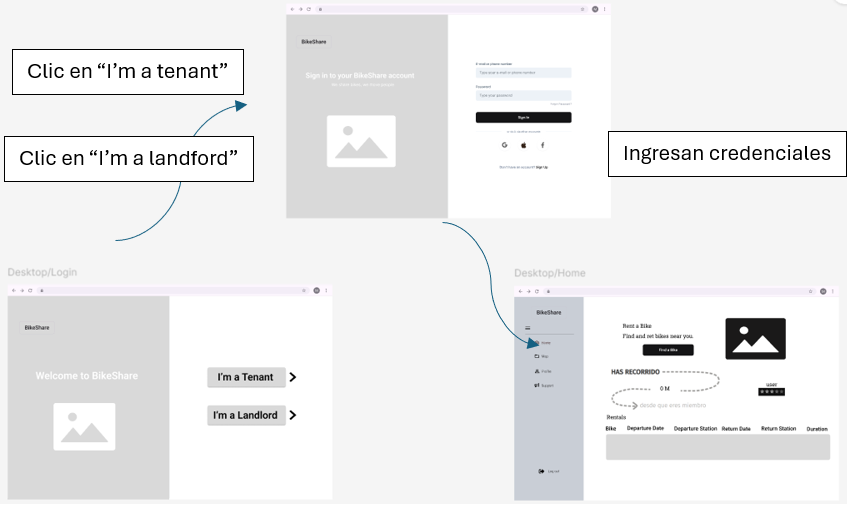
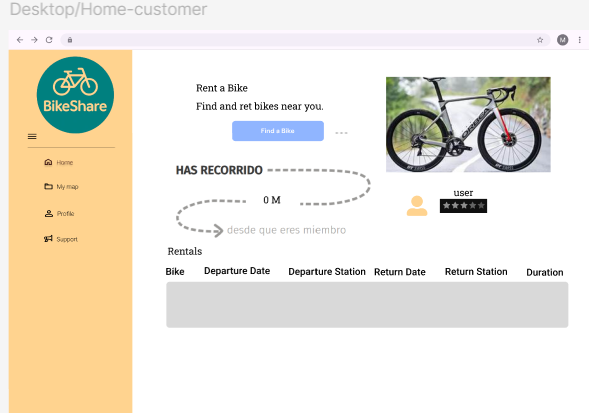
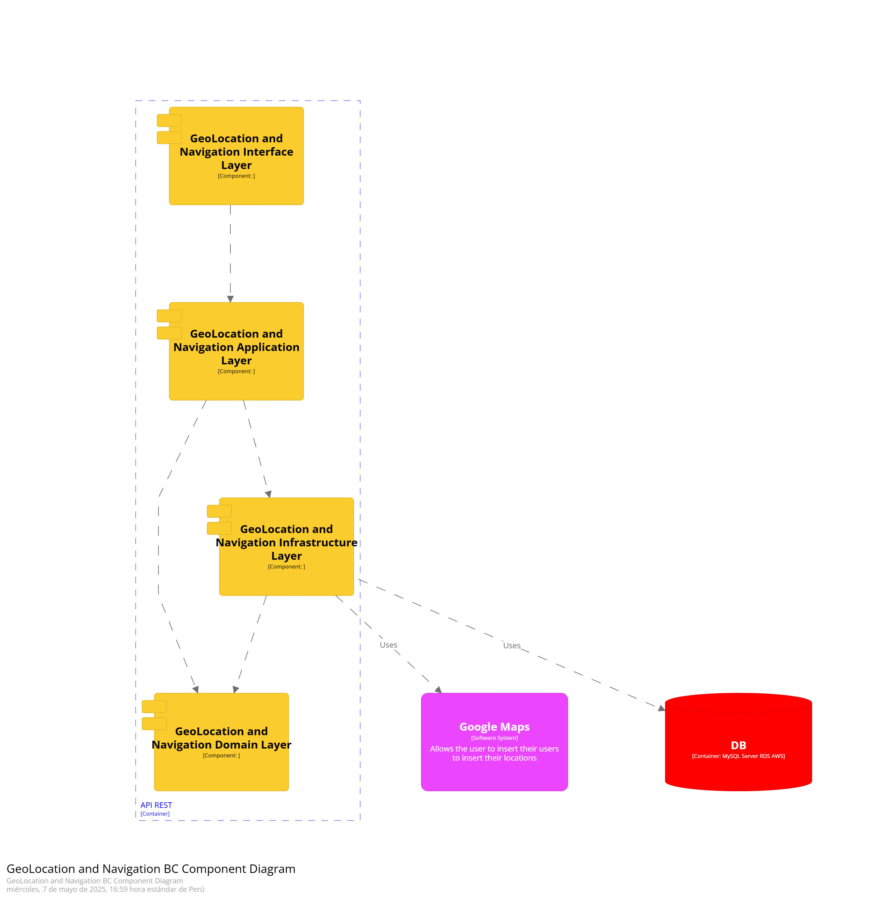

# CAPÍTULO IV: Product Design
Gracias al Product Design **adoptamos un enfoque de diseño centrado en el usuario**, lo cual nos permitirá desarrollar productos y servicios funcionales, atractivos y alineados con las expectativas del cliente. Esta metodología será clave para resolver desafíos específicos, aportar valor tangible a nuestros usuarios y avanzar de forma más efectiva hacia nuestras metas comerciales.

## 4.1. Style Guidelines
Los **Style Guidelines** son una guía que reúne las directrices para asegurar un diseño y presentación coherente de sitios web y software.A continuación, se presentan los parámetros aplicados para el desarrollo del proyecto.

### 4.1.1. General Style Guidelines
**Branding**  
Al momento de crear el logo de BikeShare, se optó por un modelo minimalista que refleja nuestro compromiso de brindar un servicio de transporte accesible. Se utilizaron colores suaves, lo que permite que el usuario identifique fácilmente el logo y lo mantenga reconocible.  

  

**Typography**  
Para la tipografía de BikeShare, se eligió una fuente elegante y funcional que complementa la imagen general de la aplicación. La tipografía principal es **Roboto**, una fuente que ofrece excelente legibilidad en dispositivos móviles y proporciona un toque moderno y profesional al diseño. Para generar contraste en los textos importantes, se optó por **Roboto Slab**, una fuente llamativa que destaca la información clave y capta la atención del usuario.  

  

**Colors**  
La paleta de colores de BikeShare está compuesta por tonos que evocan vitalidad, tranquilidad y motivación, alineados con un estilo de vida activo y equilibrado. Los colores seleccionados son brillantes y estimulantes, permitiendo captar la atención del usuario y reflejar la esencia de un producto innovador y lleno de energía.  
 

**Spacing**  
El espaciado desempeña un papel fundamental en el diseño de BikeShare, ya que organiza la información de forma clara y coherente.Se aplicó una separación amplia entre los elementos de la interfaz para mejorar la legibilidad y facilitar la navegación del usuario. Asimismo, se mantuvo un espaciado constante en todo el diseño, aportando equilibrio y armonía a la composición.

Ejemplo de espaciado:

### 4.1.2. Web Style Guidelines
Para el desarrollo de la plataforma web se decidió implementar **Responsive Web Design**, permitiendo que la plataforma se adapte a cualquier dispositivo. Gracias a ello, el contenido se mantiene intacto, mejorando la presentación y la experiencia del usuario. Se optó por utilizar **Material Design**, ya que se enfoca en elementos clave y dirige la atención del usuario hacia los aspectos más importantes de la página.

**Icons**  
Se garantiza la consistencia y legibilidad de los íconos, asegurando que expresen claramente sus funciones y características esenciales.

**Scale**  
Se utilizará un rango de 7 tipos de esquinas en las figuras:
- None
- Extra Small
- Small
- Medium
- Large
- Extra Large
- Full

> 

### 4.1.3. Mobile Style Guidelines
Para el desarrollo de la versión móvil, se continuará utilizando **Material Design** para mantener la uniformidad entre la plataforma web y móvil.

**Transitions**  
Se aplicarán transiciones que permitan una experiencia cohesiva y predecible durante el uso de la plataforma.

## 4.2. Information Architecture
> En este apartado se detallarán el contenido visual y las etiquetas que se usarán en la elaboración del Landing Page y de la Página Web. Se revisarán tópicos como Labelling Systems, Organization Systems, SEO, Meta Tags, y Searching y Navigation Systems.

### 4.2.1. Organization Systems
**Home**  
| Tópico | Definición |
|----------|----------|
| Home | Sección principal donde se mostrará una descripción del servicio, sus características y el proceso de funcionamiento de la plataforma. |
| Our System | Sección donde se explicará cómo alquilar bicicletas. |
| Be a Partner | Sección donde se presentarán los beneficios para los arrendadores de bicicletas. |
| Reviews | Sección donde se mostrarán las opiniones de arrendadores y usuarios. |
| Log In | Sección de registro e inicio de sesión en la plataforma. |

**Our System**  
| Tópico | Definición |
|----------|----------|
| How to Rent a Bike | Pasos para alquilar una bicicleta a través de la plataforma. |

**Be a Partner**  
Sección que muestra las características y beneficios para arrendadores.

**Reviews**  
Sección que muestra los comentarios y opiniones de arrendadores y clientes sobre la plataforma.

**Log In**  
| Tópico | Definición |
|----------|----------|
| Log In | Autenticación de credenciales de perfiles existentes. |
| Sign Up | Registro de nuevos usuarios, tanto arrendadores como clientes. |

**Responsive Design**  
Permitirá una experiencia fluida y adaptable en diferentes dispositivos.

### 4.2.2. Labeling Systems
Se decidió usar etiquetas para organizar las secciones de la plataforma web, permitiendo un acceso más rápido y ordenado.

| Tópico | Definición |
|----------|----------|
| Home | Sección principal de descripción general. |
| Our System | Información sobre cómo alquilar bicicletas. |
| Be a Partner | Información para arrendadores. |
| Reviews | Opiniones de usuarios y arrendadores. |
| Log In | Acceso y registro de usuarios. |

### 4.2.3. SEO Tags and Meta Tags
Las Meta Tags permiten codificar y detallar los metadatos de la página web, facilitando su lectura y análisis por parte de los navegadores, aunque no son visibles para los usuarios.

**Título**  
Influye en el posicionamiento dentro de los motores de búsqueda.  
`<title>Rent bikes with us - BikeShare</title>`

**Codificación de caracteres**  
Se utilizó **UTF-8** por su eficiencia para caracteres del Plano Multilingüe Básico (BMP).  
`<meta charset="utf-8">`

**Descripción**  
Breve descripción para buscadores.  
`<meta name="description" content="BikeShare is a web app that helps you rent bikes around Lima."/>`

**Palabras clave**  
Facilitan la asociación temática en buscadores.  
`<meta name="keywords" content="bike, rent, lend, smart, save"/>`

**Autor y derechos de autor**  
Protección de la propiedad intelectual.  
`<meta name="author" content="BikeShare Team"/>`  
`<meta name="copyright" content="Copyright BikeShare Team"/>`

### 4.2.4. Searching Systems
El **Searching System** es fundamental para que los usuarios encuentren la información que buscan.

**Características clave:**
- **Búsqueda por distrito:** Buscar bicicletas en distritos específicos.
- **Búsqueda por disponibilidad:** Buscar bicicletas disponibles en estaciones específicas.
- **Búsqueda por calificación:** Filtrar estaciones por puntuación de usuarios.

### 4.2.5. Navigation Systems
El **Navigation System** permitirá a los usuarios desplazarse fácilmente por las secciones de la plataforma.

**Estructura de navegación:**
- Home
- Our System
- Be a Partner
- Reviews
- Log In

## 4.3. Landing Page UI Design
El diseño de la **Landing Page** es crucial, ya que será la primera impresión de nuestro producto. Debemos crear una experiencia que capte la atención de los usuarios y los incentive a regresar.

### 4.3.1. Landing Page Wireframe
**Web Version - Home Page**  
Sección principal que presenta el servicio.

**Web Version - Our System**  
Explicación de cómo alquilar bicicletas.

**Web Version - Be a Partner**  
Información para arrendadores.

**Web Version - Reviews**  
Opiniones de usuarios.

**Mobile Web Version - Home Page**

**Mobile Web Version - Our System**

**Mobile Web Version - Be a Partner**

**Mobile Web Version - Reviews**

### 4.3.2.Landing Page Mock-up
**Web Version - Home Page**  
Sección principal que presenta el servicio.

**Web Version - Our System**  
Explicación de cómo alquilar bicicletas.

**Web Version - Be a Partner**  
Información para arrendadores.

**Web Version - Reviews**  
Opiniones de usuarios.

## 4.4.Web Applications UX/UI Design
### 4.4.1.Web Applications Wireframes
**Web Version - Login**  

**Web Version - Sing Up**  

**Web Version - Home**  

**Web Version - Map**  

**Web Version - Profile**  

**Web Version - Home Arrendatario**  

**Web Version - Addbike Arrendatario**  

### 4.4.2.Web Applications Wireflow Diagrams

User Goals: 
Inicio de sesión 
Como usuario registrado, quiero poder iniciar sesión con mis credenciales para acceder a mi cuenta y funcionalidades. 

Selección de rol 
Como usuario, quiero poder elegir si quiero registrarme como arrendador o arrendatario desde la pantalla principal para que la plataforma me dirija a la pantalla de registro correspondiente. 

Edición de datos personales 
Como usuario, quiero poder actualizar mi perfil y datos personales para mantener mi información actualizada. 

Cierre de sesión 
Como usuario, quiero cerrar sesión de forma segura para proteger mi cuenta cuando dejo de usar la plataforma. 

Edición de información de una bicicletaa 
Como arrendador, quiero editar la información de mis bicicletas para actualizar detalles. 

Eliminación de una bicicleta 
Como arrendador, quiero eliminar bicicletas que ya no deseo alquilar para mantener mi listado limpio y actualizado. 

Historial de alquileres 
Como arrendador, quiero visualizar un historial de alquileres de mis bicicletas para conocer la demanda y evaluar ingresos. 

Visualización de estadísticas de uso 
Como arrendador, quiero visualizar estadísticas de uso e ingresos generados por mis bicicletas para tomar mejores decisiones sobre mi oferta. 

Configuración de disponibilidad 
Como arrendador, quiero establecer días y horas disponibles para cada bicicleta para evitar reservas en momentos no deseados. 

Búsqueda de bicicletas por ubicación y disponibilidad 
Como arrendatario, quiero buscar bicicletas disponibles según mi ubicación y horario deseado para encontrar opciones convenientes. 

Visualización de detalles de bicicletas 
Como arrendatario, quiero ver información detallada de cada bicicleta incluyendo reseñas antes de alquilarla para tomar una decisión informada. 

Alquiler de bicicleta	 
Como arrendatario, quiero poder reservar una bicicleta por un periodo específico para utilizarla según mi necesidad. 

Gestión de alquileres		 
Como arrendatario, quiero ver mis alquileres actuales y pasados para gestionar el uso y control de mis reservas. 

### 4.4.3.Web Applications Mock-ups

**Web Version - Login**  

**Web Version - Sing Up**  

**Web Version - Home**  

**Web Version - Map**  

**Web Version - Profile**  

### 4.4.4.Web Applications User Flow Diagrams

User Goals: 
Inicio de sesión 
Como usuario registrado, quiero poder iniciar sesión con mis credenciales para acceder a mi cuenta y funcionalidades. 

Selección de rol 
Como usuario, quiero poder elegir si quiero registrarme como arrendador o arrendatario desde la pantalla principal para que la plataforma me dirija a la pantalla de registro correspondiente. 

Edición de datos personales 
Como usuario, quiero poder actualizar mi perfil y datos personales para mantener mi información actualizada. 

Cierre de sesión 
Como usuario, quiero cerrar sesión de forma segura para proteger mi cuenta cuando dejo de usar la plataforma. 

Edición de información de una bicicletaa 
Como arrendador, quiero editar la información de mis bicicletas para actualizar detalles. 

Eliminación de una bicicleta 
Como arrendador, quiero eliminar bicicletas que ya no deseo alquilar para mantener mi listado limpio y actualizado. 

Historial de alquileres 
Como arrendador, quiero visualizar un historial de alquileres de mis bicicletas para conocer la demanda y evaluar ingresos. 

Visualización de estadísticas de uso 
Como arrendador, quiero visualizar estadísticas de uso e ingresos generados por mis bicicletas para tomar mejores decisiones sobre mi oferta. 

Configuración de disponibilidad 
Como arrendador, quiero establecer días y horas disponibles para cada bicicleta para evitar reservas en momentos no deseados. 

Búsqueda de bicicletas por ubicación y disponibilidad 
Como arrendatario, quiero buscar bicicletas disponibles según mi ubicación y horario deseado para encontrar opciones convenientes. 

Visualización de detalles de bicicletas 
Como arrendatario, quiero ver información detallada de cada bicicleta incluyendo reseñas antes de alquilarla para tomar una decisión informada. 

Alquiler de bicicleta	 
Como arrendatario, quiero poder reservar una bicicleta por un periodo específico para utilizarla según mi necesidad. 

Gestión de alquileres		 
Como arrendatario, quiero ver mis alquileres actuales y pasados para gestionar el uso y control de mis reservas. 

## 4.5.Web Applications Prototyping

## 4.6.Domain-Driven Software Architecture
En esta seccion se presentaran los tres niveles del modelo C4 aplicando Domain Driven Design.

### 4.6.1.Software Architecture Context Diagram.
El diagrama de contexto nos muestra los tipos de usuario que interactuan con el aplicativo web, y a la vez los servicios y/o con los que la plataforma interactua.   
  
### 4.6.2.Software Architecture Container Diagrams.  
Este diagrama nos permite tener una vision enfocada al desarrollo. Se muestra la forma en la que los usuarios interactuan con la Landing Page, Web App y Mobile App. A la vez que se muestra como estas plataformas interactuan con los servicios externos vinculados.  

  
### 4.6.3.Software Architecture Components Diagrams.  
En esta seccion se muestra los diagramas de comppnentes de cada uno de los bounded contexts definidos.  
**APIRest - Component**  
  
**Geolocation - Component**  
  
**Bike Inventory - Component**  
  
**Lender Management - Component**  
  
**Bike Rental - Component**  
  
**Notification - Component**  
  
**Review - Component**  
  
**Payment - Component**  
  
**User Management - Component**  
  

## 4.7.Software Object-Oriented Design.
### 4.7.1.Class Diagrams
**General Diagram**  
  
**Geolocation - Component**  
  
**Bike Inventory - Component**  
  
**Lender Management - Component**  
  
**Bike Rental - Component**  
  
**Notification - Component**  
  
**Review - Component**  
  
**Payment - Component**  
  
**User Management - Component**  
  

### 4.7.2.Class Dictionary.
#### User Management BC

#### User

- userId: Identificador único del usuario.

- email: Correo electrónico.

- passwordHash: Contraseña cifrada.

- fullName: Nombre completo del usuario.

- role: Indica si el usuario es CLIENT o LENDER.

#### UserRole (enum)

- CLIENT: Usuario que alquila bicicletas.

- LENDER: Usuario que presta sus bicicletas a la plataforma.

#### AuthService

login(email, password): Autentica a un usuario y retorna un AuthToken.

register(userData): Registra un nuevo usuario.

resetPassword(email): Inicia el proceso de restablecimiento de contraseña.

#### Bike Inventory BC

#### Bike

bikeId: Identificador único de la bicicleta.

ownerId: Identificador del propietario (LENDER).

model: Modelo de la bicicleta.

type: Tipo de bicicleta (ROAD, MOUNTAIN, etc.).

location: Coordenadas geográficas actuales.

status: Estado operativo actual de la bicicleta.

#### BikeType (enum)

ROAD, MOUNTAIN, ELECTRIC, HYBRID: Tipos de bicicletas.

#### BikeStatus (enum)

AVAILABLE, IN_USE, RESERVED, MAINTENANCE: Estados operacionales posibles.

#### GeoPoint

latitude: Latitud geográfica.

longitude: Longitud geográfica.

#### InventoryService

registerBike(bikeData): Registra una bicicleta en el sistema.

updateBikeLocation(bikeId, GeoPoint): Actualiza la ubicación de la bicicleta.

setBikeStatus(bikeId, status): Cambia el estado operativo.

getAvailableBikes(location, radius): Devuelve bicicletas disponibles cercanas.

#### Rental Operations BC

#### Rental

rentalId: Identificador único del alquiler.

bikeId: Bicicleta alquilada.

clientId: Cliente que realiza el alquiler.

startTime: Fecha y hora de inicio.

endTime: Fecha y hora de fin.

status: Estado del alquiler.

price: Precio del alquiler.

#### RentalStatus (enum)

ONGOING, COMPLETED, CANCELLED: Estados posibles del alquiler.

#### RentalService

startRental(bikeId, clientId): Inicia un nuevo alquiler.

endRental(rentalId): Finaliza el alquiler.

calculatePrice(rentalId): Calcula el precio del alquiler.

#### Lender Management BC

#### LenderProfile

lenderId: Identificador del LENDER (igual que userId).

bio: Descripción o biografía del lender.

totalEarnings: Total acumulado de ingresos por alquileres.

rating: Calificación promedio basada en reviews.

#### LenderService

getLenderDashboard(lenderId): Retorna métricas del lender.

listBikes(lenderId): Lista las bicicletas del lender.

#### DashboardData

earnings: Dinero ganado por el lender.

activeBikes: Número de bicicletas disponibles.

totalRentals: Total de alquileres completados.

#### Payment & Billing BC

#### Payment

paymentId: Identificador del pago.

rentalId: Alquiler asociado al pago.

userId: Usuario que realiza el pago.

amount: Cantidad pagada.

timestamp: Fecha y hora del pago.

status: Estado actual del pago.

#### PaymentStatus (enum)

PENDING, COMPLETED, FAILED: Posibles estados del pago.

#### BillingService

processPayment(userId, rentalId): Procesa el pago de un alquiler.

refundPayment(paymentId): Procesa la devolución.

generateInvoice(userId): Genera la factura del usuario.

#### Invoice

invoiceId: Identificador de la factura.

userId: Usuario asociado.

amount: Total facturado.

issuedDate: Fecha de emisión.

lineItems: Detalle de cargos.

#### Geolocation & Navigation BC

#### GeoService

getNearbyBikes(location, radius): Encuentra bicicletas cercanas.

trackBike(bikeId): Retorna ubicación actual de la bicicleta.

getParkingZones(): Devuelve zonas de aparcamiento disponibles.

#### GeoZone

zoneId: Identificador único de la zona.

coordinates: Coordenadas que definen la zona.

#### Review & Feedback BC

#### Review

reviewId: Identificador del review.

reviewerId: Usuario que hizo la review.

targetUserId: Usuario evaluado.

rating: Puntaje (por ejemplo, del 1 al 5).

comment: Comentario del usuario.

submittedAt: Fecha de envío.

#### ReviewService

submitReview(reviewerId, targetUserId, rating, comment): Crea un review.

getUserReviews(userId): Obtiene reviews de un usuario.

#### Notification BC

#### Notification

notificationId: Identificador de la notificación.

userId: Destinatario.

message: Contenido del mensaje.

type: Categoría de notificación.

createdAt: Fecha de creación.

#### NotificationType (enum)

REMINDER, ALERT, PROMOTION: Tipos de notificaciones.

#### NotificationService

sendNotification(userId, message, type): Envía una notificación.

getUserNotifications(userId): Lista notificaciones del usuario.
## 4.8.Database Design.
### 4.8.1.Database Diagram.

