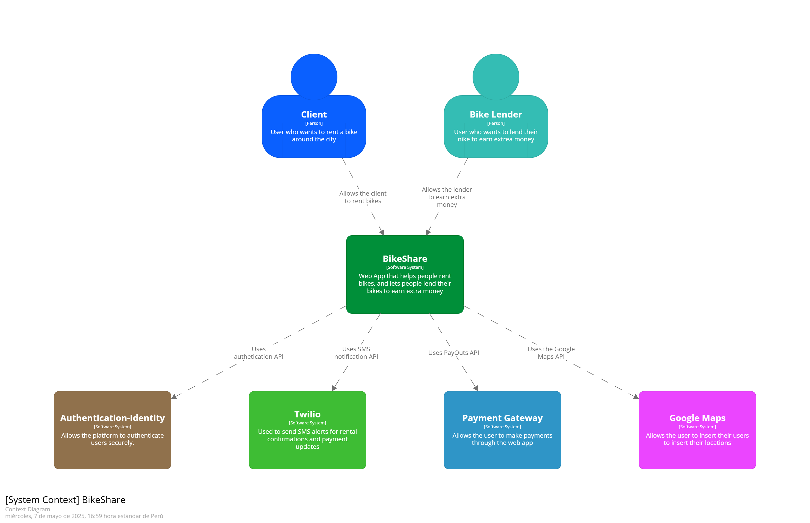
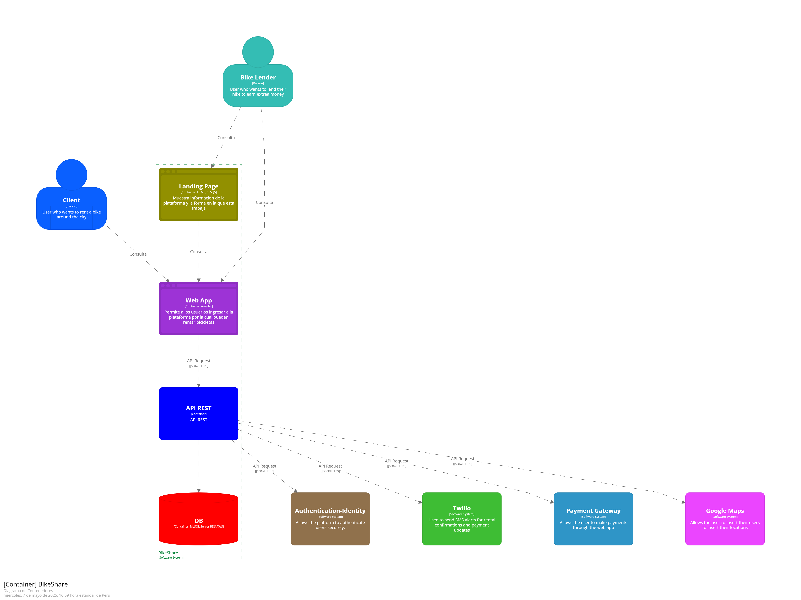

# CAPITULO IV: Product Design
> Gracias al Product Design **adoptamos un enfoque de diseño centrado en el usuario**, lo cual nos permitirá desarrollar productos y servicios funcionales, atractivos y alineados con las expectativas del cliente.
>
> Esta metodología será clave para resolver desafíos específicos, aportar valor tangible a nuestros usuarios y avanzar de forma más efectiva hacia nuestras metas comerciales.

## 4.1.Style Guidelines
> Los **Style Guidelines** es una guia la cual reune las directrices para asegurar un diseño y presentacion coherente de sitios web y software.
> Ahora se presentaran los parametros aplicados para el desarrollo del proyecto.
### 4.1.1.General Style Guidelines
> **Branding**#  
> Al momento de crear el logo de BikeShare, se decidio por un modelo minimalista el cual refleja nuestro compromiso de brindar un servicio de transporte accesible. Los colores utilizados son suaves, los cuales permiten que el usuario no tenga problema en identificarlo y se mantenga reconocible.  
>
>   
>
> **Typography**  
> Para la tipografia de BikeShare, se ha elegido una fuente elegante y funcional que complementa la imagen general de la aplicacion.
> La tipografia principal es Roboto, una fuente que ofrece execelente legibilidad en dipositivos moviles y proporciona un toque moderno y profesional al diseño.
> Para mostrar contraste en los textos, se ha optado por la fuente RobotoSlab, la cual es llamativa. Esto permitira destacar informacion importante y captar la atencion del usuario.
>
>
> Ahora, se mostraran las tipografias respectivas:
> 
>
>   
> **Colors**  
> La paleta de colores de RepairLink está compuesta por tonos que evocan vitalidad, tranquilidad y motivación, alineados con un estilo de vida activo y equilibrado.
> Los colores seleccionados son brillantes y estimulantes, lo que permite captar la atención del usuario y reflejar la esencia de un producto innovador y lleno de energía.
> A continuación, se detallan los colores elegidos:
>
> 
>
>**Spacing**  
> El espaciado desempeña un papel fundamental en el diseño de BikeShare, ya que permite organizar la información de forma clara y coherente. Se ha aplicado una separación amplia entre los elementos de la interfaz para mejorar la legibilidad y facilitar la navegación del usuario. Asimismo, se ha mantenido un espaciado constante en todo el diseño, lo que aporta equilibrio y armonía a la composición.
>
> 
>
### 4.1.2.Web Style Guidelines
> Para el desarrollo de la plataforma web se ha decidido implementar Web Responsive Design, esto permitira que la plataforma se pueda adaptar al dispositivo en el cual se ingrese. Gracias a esto el contenido se mantendra intacto, mejorando la presentacion y la experiencia del usuario. Se ha optado usar Material Design para la experiencia de usuario ya que este se enfoca en los elementos clave y enfoca la atencion del usuario asia la pagina.
>
>   **Icons**  
> Nos aseguraremos de la consistencia y capacidad de lectura de los iconos a las ves que se expresaran las caracteristicas esenciales de esta.
>
> 
>
>   **Scale**  
> Se usara un rango de 7 tipo de esquinas en las figuras:
>- None
>- Extra Small
>- Small
>- Medium
>- Large
>- Extra
>- Large
>- Full
>
> 
>
### 4.1.3.Mobile Style Guidelines
> Para el desarrollo de la version mobil se continuara con el uso de Material Design para mantener la uniformidad de platafoma web en diferentes dispositivos.
>
>   **Transitions**  
> Se aplicaran transiciones la cuales permitan que la plataforma tenga una sensancion cohesiva y predecible al momento de usarla 
> 
>
## 4.2.Information Architecture
>En este apartado de detallaran el contenido visual y los tagas que se usaran en la elaboracion del Landing Page y la Pagina Web. Se revisaran topicos tales como
>los Labelling Systems, Organization Systems, SEO, Meta Tags y Searaching y Navigation Sytems.
>
>### 4.2.1.Organization Systems
> **Home**  
| Topico  | Definicion |
|----------|----------|
| Home | Seccion principal en la cual se mostrara una descripicion del servicios, sus caracteristicas y el proceso de funcionamiento de la plataforma |
| Our System | Seccion en la cual se mostrara la forma en la que se pueden alquilar las bicicletas |
| Be a Partner | Seccion en donde se mostrara los beneficios que se le brinda a los arrendadores de bicicletas   |
| Reviews  | Seccion en la cual se mostraran las opiniones tanto de los arrendadores, como de los usuarios que alquilan bicicletas  |
| Log In    | Seccion por la cual el usuario se registrara en la plataforma  |
>   **OurSystem**  
| Topico  | Definicion |
|----------|----------|
| How to Rent a Bike | Seccion en la cual se mostraran los pasos para alquilar una bicicleta |
>  **Be a partner**  
> En esta seccion se muestran las caracteristicas de la plataforma para los arrendadores.
>
>   **Reviews**  
> Esta seccion mostarara los comentarios dejado por los arrendadores y los clientes respecto a la calidad de plataforma web
>   **Log In**  
| Topico  | Definicion |
|----------|----------|
| Log In | Seccion en la cual se autenticaran las credenciales de un perfil ya existente para acceder a este  |
| Sign Up   | Seccion en la caul se requerira llenar campos con datos personales para poder registrase tanto como Arrendador o Cliente |
>   **Responsive Design**  
>Sera posible tener una experiencia fluida y adaptable para los diferentes dispositivos por los cuales el usuario ingrese a la plataforma
### 4.2.2.Labeling Systems
> Se ha decidido usar etiquetas, estas permitiran organizar en grupos las secciones de la plataforma web. Estas seras accesibles dando click
> a cada etiqueta  
| Topico  | Definicion |
|----------|----------|
| Home | Seccion principal en la cual se mostrara una descripicion del servicios, sus caracteristicas y el proceso de funcionamiento de la plataforma |
| Our System | Seccion en la cual se mostrara la forma en la que se pueden alquilar las bicicletas |
| Be a Partner | Seccion en donde se mostrara los beneficios que se le brinda a los arrendadores de bicicletas   |
| Reviews  | Seccion en la cual se mostraran las opiniones tanto de los arrendadores, como de los usuarios que alquilan bicicletas  |
| Log In    | Seccion por la cual el usuario se registrara en la plataforma  |
### 4.2.3.SEO Tags and Meta Tags
>Las Meta Tags permiten codificar y detallar los metadatos que una pagina web contiene. Estas son leidas por navegadores y no pueden ser vistos por los usuarios. Gracias
>a estas etiquetas, se facilita la lectura y analisis de archivos HTML.
> **Titulo** 
>Las Meta Tags influyen en el posicionamiento de paginas dentro de los diferentes motores de busqueda existentes.  
>`<title>Rent bikes with us BikeShare</title>`  
>**Codificacion de caracteres**  
>Para el desarrollo se uso UFT-8. Esto debido a su eficiencia en termios de memoria para caracteres BMP (Plano Multingue Basico)  
>`<meta charset="utf-8">`  
>**Descripcion** 
>Nos permite brindar una breve despricion de lo que los usuarios pueden encontrar en la pagina web.  
>`<meta name="description" content="BikeShare is a web app that will help you find rent bikes arounf Lima"/>`
>  **Palabras Clave**  
>Etiqueta la cual permite destacar palabras claves realcionadas con el proposito de la pagina web.  
>`<meta name="keywords" content="bike, rent, lend, smart, save"/>`
>  **Autor y derechos de autor** 
> Registra los dererchos de autor, propiedad y autor de la pagina web.  
>`<meta name="author" content="BikeShare"/>`  
>`<meta name="copyright" content="Copyright BikeShare Team"/>`
### 4.2.4.Searching Systems
> El Searching System es de vital importancia para que los usuarios pueden encontrar los datos que buscan
>  **Caracteristicas Claves**  
>***Busqueda por distrito:*** Los usuarios pueden busacr bicicletas en base al distrito deseado  
> ***Busqueda por disponibilidad:*** Los usaurio pueden buscar en base a cuantas biciletas hay en cierta estacion  
> ***Busqueda por calificacion:*** Los usuarios pueden filtrar estaciones en base a las calificaciones de los usuarios  
### 4.2.5.Navigation Systems
> El Navigation System permite a los usuarios desplazarase por las diferente secciones de la plaforma de forma fluida.
>  **Estructura de Navegacion:**
> - Home
> - Our System
> - Be a Partner
> - Reviews
> - Log In
>
## 4.3.Landing Page UI Design
> El diseño aimplementar en la Landing Page sera de suma importancia, ya que este sera el primer vistazo que los usuarios tendran de nuestro producto. Para esto debemos crear una experiencia que captura la atencion de los usuarios de la pagina y los incentive a regresar progresivamente.
### 4.3.1.Landing Page Wireframe
> **Web Version - Home Page**  
> Esta sera la seccion inicial a la cual el usuario sera enviado al momento de ingresar a nuestra plataforma. Aqui se mostrara proceso por el cual nuestro servicio es ofrecido.  
>   
> **Web Version - OurSystem**  
>En esta seccion se mostrara como poder rentar una bicicleta en nuestra plataforma  
>   
> **Web Version - Be a Partner**  
> Seccion en la cual se mostrara como unirte a nuestra plataforma como arrendador  
>   
> **Web Version - Reviews**  
> Seccion en la cual se mmostraran las opiniones de nuestros usuarios, tanto clientes como arrendadores  
>   
> **Mobile Web Version - Home Page**  
>Esta sera la seccion inicial a la cual el usuario sera enviado al momento de ingresar a nuestra plataforma. Aqui se mostrara proceso por el cual nuestro servicio es ofrecido.  
>   
> **Mobile Web Version - OurSystem**  
>En esta seccion se mostrara como poder rentar una bicicleta en nuestra plataforma  
>  
>**Mobile Web Version - Be a Partner**  
> Seccion en la cual se mostrara como unirte a nuestra plataforma como arrendador  
>   
>**Mobile Web Version - Reviews**  
> Seccion en la cual se mmostraran las opiniones de nuestros usuarios, tanto clientes como arrendadores  
>  
### 4.3.2.Landing Page Mock-up
## 4.4.Web Applications UX/UI Design
### 4.4.1.Web Applications Wireframes
### 4.4.2.Web Applications Wireflow Diagrams
### 4.4.3.Web Applications Mock-ups
### 4.4.4.Web Applications User Flow Diagrams
## 4.5.Web Applications Prototyping
## 4.6.Domain-Driven Software Architecture
> En esta seccion se presentaran los tres niveles del modelo C4 aplicando Domain Driven Design.
### 4.6.1.Software Architecture Context Diagram.
> El diagrama de contexto nos muestra los tipos de usuario que interactuan con el aplicativo web, y a la vez los servicios y/o con los que la plataforma interactua.   
>   
### 4.6.2.Software Architecture Container Diagrams.  
> Este diagram nos permite tener una vision enfocada al desarrollo. Se muestra la forma en la que los usuarios interactuan con la Landing Page, Web App y Mobile App.
> A la vez que se muestra como estas plataformas interactuan con los servicios externos vinculados.  
>   
### 4.6.3.Software Architecture Components Diagrams.  
>En esta seccion se muestra los diagramas de comppnentes de cada uno de los bounded contexts definidos.  
> **APIRest - Component**  
>   
> **Bike Inventory - Component**  
>   
> **Bike Owner - Component**  
>   
> **Bike Rental - Component**  
>   
> **Notification - Component**  
>   
> **Review - Component**  
>   
> **Payment - Component**  
>   
> **User Management - Component**  
>   
## 4.7.Software Object-Oriented Design.
### 4.7.1.Class Diagrams
> **General Diagram**  
>   
> **Geolocation - Component**  
>   
> **Bike Inventory - Component**  
>   
> **Lender Management - Component**  
>   
> **Bike Rental - Component**  
>   
> **Notification - Component**  
>   
> **Review - Component**  
>   
> **Payment - Component**  
>   
> **User Management - Component**  
>   
### 4.7.2.Class Dictionary.
## 4.8.Database Design.
### 4.8.1.Database Diagram.
