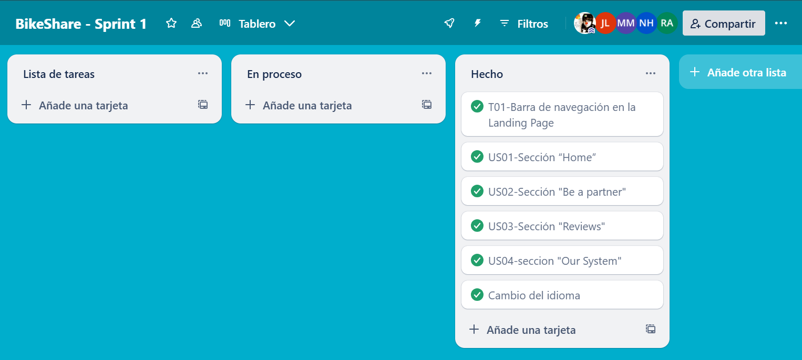

# Capítulo V: Product Implementation, Validation & Deployment
## 5.1. Software Configuration Management
### 5.1.1. Software Development Environment Configuration

**Requirements Management**

1. Trello: Es una herramienta utilizada para gestionar el flujo de trabajo de proyectos principalmente basados en marcos detrabajos ágiles. Será empleado para visualizar y actualizar el estado actual de las tareas e historias de usuariopertenecientes al sprint a desarrollar. Ruta de referencia https://trello.com/es
2. Vertabelo: Herramienta técnica para diseñar y modelar bases de datos. Ruta de referencia https://vertabelo.com

**Product UX/UI Design**

1. Figma: Plataforma de elaboración de prototipos y edición gráfica, principalmente utilizado para el diseño digital. En elcaso del proyecto, será utilizado para el prototipado de la aplicación y sus versiones de Desktop y Mobile Web Browser.Ruta de referencia https://www.figma.com/login2.
2. LucidChart: Aplicación para diagramar flujos. Será empleado para el diseño de wireflows, user-flows y el diagrama declases asociado a la aplicación. Ruta de referencia https://www.lucidchart.com/

**Software Development**

1. WebStorm: Entorno de desarrollo integrado elegido para la elaboración y compilación del código por motivos dedominio por parte de los integrantes del equipo de trabajo. Utilizar este IDE supone de valor para el desarrollo del proyecto puesto que incluye la posibilidad de agregar extensiones de utilidad, soporte de edición de texto en múltipleslenguajes de programación, disponibilidade en múltiples sistemas operativos, entre otros beneficios. Ruta de referencia https://www.jetbrains.com/webstorm/
2. HTML5: HyperText Markup Language, o por sus siglas HTML, es un lenguaje de etiquetado para páginas web. Seráempleado en el desarrollo del proyecto para la presentación del contenido en la aplicación. Ruta de referenciahttps://www.w3schools.com/html/html5_syntax.asp
3. CSS: Cascading Style Sheets es un lenguaje que maneja el diseño y presentación de las página
para elaborar la interfaz deusuario dentro de la aplicación. Ruta de referencia https://developer.mozilla.org/es/docs/Web/JavaScript
5. Angular: Angular es un framework de desarrollo de aplicaciones web de código abierto y basado en TypeScript, mantenido por Google y una comunidad de desarrolladores. Es utilizado para crear aplicaciones web de una sola página (SPA) y aplicaciones web dinámicas. Angular proporciona un conjunto de herramientas y bibliotecas que simplifican el desarrollo de aplicaciones web complejas al seguir el patrón de arquitectura Modelo-Vista-Controlador (MVC) y ofrecer funcionalidades como enlace de datos bidireccional, inyección de dependencias, rutas, formularios reactivos, animaciones y mucho más https://angular.io/

**Software Deployment**

1. Git: Herramienta de control de versiones que permite registrar y gestionar las diferentes versiones del programa. Seutilizará para mantener un historial de cambios y simplificar la corrección de errores. Los miembros del equipo accederána través de la línea de comandos en sus sistemas locales. Ruta de referencia https://git-scm.com/

**Software Documentation and Project Management**

1. Github: Plataforma basada en la nube que alojará los repositorios de código del proyecto. Facilitará la colaboración entiempo real y la revisión de contribuciones de cada miembro del equipo. Los miembros del equipo accederán a través desus navegadores web. Ruta de referencia https://github.com/

### 5.1.2. Source Code Management

Para organizar nuestro proyecto y sus modificaciones, hemos seguido lo propuesto por Vincent Dreissen: un modelo de Git de branching permite gestionar ramas de un proyecto, asi como facilitar el flujo de trabajo. Partimos con una main branch o rama master, y junto a ella, una develop branch. A partir de la rama master, surgen las Hotfix branches, que nos permiten solucionar problemas criticos directamente de la rama master. También creamos Feature branches para los cambios que hicimos a lo largo del proyecto. Estos, mediante un merge, se unen a la develop Branch. Y la develop branch al Main.

**Liks del repositorio de GitHub**:

- Link de la organización: https://github.com/upc-pre-2025101asi0729-G05-RepoRangers
- Link de la landing page: https://github.com/upc-pre-2025101asi0729-G05-RepoRangers/LandingPage
- Link del informe: https://github.com/upc-pre-2025101asi0729-G05-RepoRangers/Report
- Link del front end: https://github.com/upc-pre-2025101asi0729-G05-RepoRangers/Frontend
- Link del back end: https://github.com/upc-pre-2025101asi0729-G05-RepoRangers/Backend

Estrucutra de las ramas:

- **Main Branch:** Esta rama es la principal de la aplicación. Donde se encontrarán las versiones más estables del desarrollo. Solo se admiten cambios que hayan sido probados en otras ramas.
- **Develop Branch:** Esta rama es donde se realizarán los avances del proyecto y desarollo.
- **Feature Branch:** Esta rama es donde se implementarán nuevas características de la aplicación, para luego ser enviada a la rama de desarrollo.
- **Release Branch:** Esta rama es una instancia de la rama Develop, para posteriormente ser enviada a la rama Main.
- **Hotfix Branch:** Estas ramas son creadas con la finalidad de corregir errores puntuales que puedan estar perjudicando al usuario en su experiencia de uso de la aplicación.

### 5.1.3. Source Code Style Guide & Conventions

**HTML**: Unas de las prácticas que hemos seguido para alcanzar un código limpio, conciso, coherente, legible y escalable son las siguientes:

- Se usan elementos HTML que tengan un significado claro y preciso para el contenido que se está marcando. Por ejemplo, utiliza header, nav, main, article, section, aside, footer, entre otros, para estructurar la landing page de forma semántica.
- Aunque HTML5 permite algunas etiquetas sin cierre (como "img" y "input"), utilizamos la buena práctica de cerrar todas las etiquetas correctamente para evitar problemas de renderizado. Por ejemplo: `
 Código claro y legible.
`
- Para mejorar la accesibilidad, siempre incluye el atributo alt en las etiquetas "img" para describir brevemente el contenido de la imagen. Por ejemplo: ``
- HTML permite combinar mayúsculas y minúsculas en los nombres de los elementos y atributos, pero limitamos dar
  al uso de solo minúsculas para preservar el orden y asegurar la legibilidad del código.
- No omitir las etiquetas `<html>`, `<body>` y `<header>`.
- Escribir en una línea los comentarios cortos.

**CSS**: Entre las prácticas se mencionan:

- Los nombres de clases son intuitivos, legibles y autodescriptivos.
- Separar los nombres de las clases y ID con guión, por ejemplo: `#userViajero-id` y`.userImg-shape{}`
- Separar las declaraciones y selectores en nuevas líneas para agilizar la legibilidad.
- Usar comentarios para explicar el código.
- Aplicar sangría a todo el contenido de un bloque.

**JavaScript**: Principales prácticas aplicadas:

- Uso de camelCase para nombrar variables y funciones. Por ejemplo, `myVariable` y `myFunction`.
- Uso de PascalCase para nombrar clases y constructores.Por ejemplo, `myClass`.
- Evitar el uso de nombres de variables genéricos o ambiguos.
- Uso general de comentarios para explicar el propósito y funcionalidad de la porción del código.
- Uso de punto y coma al final de cada declaración.
- Uso de comillas simples ('') o comillas dobles ("") de forma consistente para las cadenas de texto.
- Organización del código en bloques lógicos separados por líneas en blanco para mejorar la legibilidad.
- Uso de el operador ternario `(condición ? resultadoTrue : resultadoFalse)` de manera adecuada y legible.
- Evitar el uso de funciones obsoletas o en desuso.
- Uso de try-catch para manejar y gestionar errores de manera adecuada.

### 5.1.4. Software Deployment Configuration

Para desplegar la landing page es necesario contar con una serie de requisitos, entre ellos, es necesario contar con una cuenta personal, una organización y un repositorio al cual cargar los documentos. A partir de lo anterior, es posible comenzar el despliegue de la landing page. A continuación se enuncian los pasos a seguir:
Crear una carpeta llamada "docs" para alojar el Landing Page. Asegurarse de que los archivos sigan las nomenclaturas "index.html", "style.css", "funcionalities.js" y una carpeta llamada "img" que contenga las imágenes. Cargar los archivos al repositorio mediante un commit. Dirigirse a Settings > Pages y seleccionar el branch correspondiente, en nuestro caso es el "main". Especificar la carpeta "docs" como la fuente de la página. Esperar a que GitHub realice las comprobaciones necesarias. Una vez culminado el proceso, se obtendrá un enlace que llevará al Landing Page desplegado

## 5.2. Landing Page, Services & Applications Implementation
### 5.2.1. Sprint 1
#### 5.2.1.1. Sprint Planning 1
<table style="border-collapse: collapse; width: 100%;">
<tbody>
<tr><td style="border:1pt solid #000000;padding:5pt;vertical-align:top;"><strong>Sprint #</strong></td><td style="border:1pt solid #000000;padding:5pt;vertical-align:top;"><strong>Sprint 1</strong></td></tr>
<tr><td style="border:1pt solid #000000;padding:5pt;vertical-align:top;" colspan="2"><strong>Sprint Planning Backlog</strong></td></tr>
<tr><td style="border:1pt solid #000000;padding:5pt;vertical-align:top;">Date</td><td style="border:1pt solid #000000;padding:5pt;vertical-align:top;">2025-04-06</td></tr>
<tr><td style="border:1pt solid #000000;padding:5pt;vertical-align:top;">Time</td><td style="border:1pt solid #000000;padding:5pt;vertical-align:top;">21:00</td></tr>
<tr><td style="border:1pt solid #000000;padding:5pt;vertical-align:top;">Location</td><td style="border:1pt solid #000000;padding:5pt;vertical-align:top;">Google Meet</td></tr>
<tr><td style="border:1pt solid #000000;padding:5pt;vertical-align:top;">Prepared By</td><td style="border:1pt solid #000000;padding:5pt;vertical-align:top;">Karen Ramos</td></tr>
<tr><td style="border:1pt solid #000000;padding:5pt;vertical-align:top;">Attendees</td><td style="border:1pt solid #000000;padding:5pt;vertical-align:top;">Todos los miembros de RepoRangers</td></tr>
<tr><td style="border:1pt solid #000000;padding:5pt;vertical-align:top;" colspan="2"><strong>Sprint Goal &amp; User Stories</strong></td></tr>
<tr><td style="border:1pt solid #000000;padding:5pt;vertical-align:top;">Sprint 1 Goal</td><td style="border:1pt solid #000000;padding:5pt;vertical-align:top;"> Se creará la organización de RepoRangers en Github y el repositorio de la organización. Además, se implementará el single page landing page.</td></tr>
<tr><td style="border:1pt solid #000000;padding:5pt;vertical-align:top;">Sprint 1 Velocity</td><td style="border:1pt solid #000000;padding:5pt;vertical-align:top;"><strong>5</strong></td></tr>
<tr><td style="border:1pt solid #000000;padding:5pt;vertical-align:top;">Sum of Story Points</td><td style="border:1pt solid #000000;padding:5pt;vertical-align:top;"><strong>8</strong></td></tr>
</tbody>
</table>

#### 5.2.1.2. Sprint Backlog 1

En el primer Sprint, se implementará la página LandingPage de TakeMyCar. La herramienta para gestionar a los miebros del equipo y visualizar los avanzes del proyecto será Trello.

Aqui podra encontrar la evidencia de Trelo:
https://trello.com/b/caq6CxCA/bikeshare-sprint-1

#### 5.2.1.3. Development Evidence for Sprint Review

A continuación se presentan informacion de los commits de la Landing page de BikeShare, con el uso de HTML, CSS y JavaScript

#### 5.2.1.4. Testing Suite Evidence for Sprint Review

En el transcurso del primer sprint, no se realizaron pruebas en la aplicación ya que nuestro enfoque estuvo dirigido exclusivamente a la construcción de la página de inicio.

#### 5.2.1.5. Execution Evidence for Sprint Review

A continuación se presentan capturas del landing page implementado parcialmente en código, con el uso de HTML, CSS y JavaScript

#### 5.2.1.6. Services Documentation Evidence for Sprint Review

En este sprint en particular, no hemos utilizado servicios web, ya que nos hemos concentrado exclusivamente en la creación de la página de inicio estática. Por lo tanto, en esta presentación no se proporciona documentación relacionada con la utilización de servicios web.

#### 5.2.1.7. Software Deployment Evidence for Sprint Review

Hasta ahora, no hemos utilizado servicios web en el proceso de desarrollo de la página de inicio. Esto significa que no hemos realizado actividades como la creación de cuentas, la configuración de recursos en proveedores de servicios en la nube, la creación de proyectos de desarrollo para la integración o automatización de tareas de implementación, entre otras acciones relacionadas.

En cuanto al despliegue de la página de inicio, lo hemos realizado en la plataforma de Github Pages.

Se puede acceder a la página de inicio a través del siguiente enlace: https://1asi0729-2510-4313-g5-bikeshare.github.io/LandingPage/

#### 5.2.1.8. Team Collaboration Insights during Sprint

A continuación se presentan capturas de los insights del repositorio del landing page en Github

### 5.2.2. Sprint 2
#### 5.2.2.1. Sprint Planning 2
#### 5.2.2.2. Aspect Leaders and Collaborators
#### 5.2.2.3. Sprint Backlog 2
#### 5.2.2.4. Development Evidence for Sprint Review
#### 5.2.2.5. Execution Evidence for Sprint Review
#### 5.2.2.6. Services Documentation Evidence for Sprint Review
#### 5.2.2.7. Software Deployment Evidence for Sprint Review
#### 5.2.2.8. Sprint Planning 2

# Conclusiones
### Conclusiones y recomendaciones
### Video About-the-Team

---
# Bibliografía

---
# Anexos

