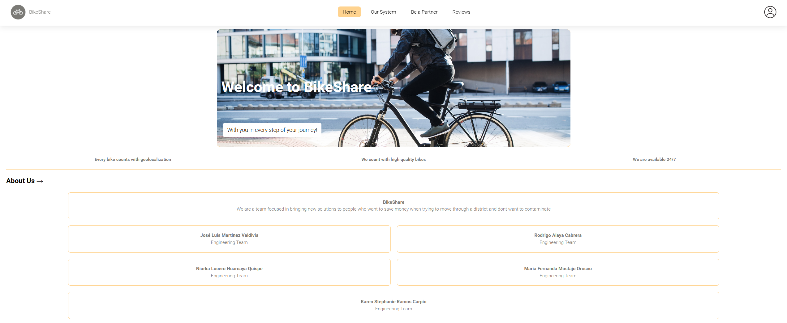
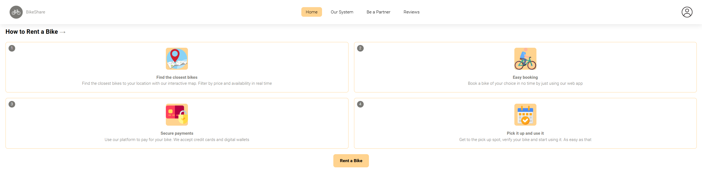
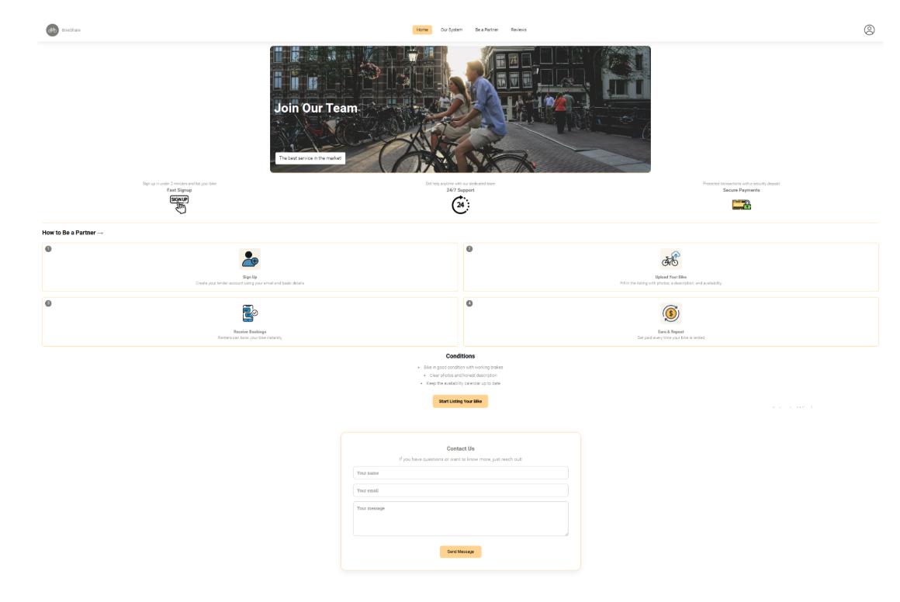

# Capítulo V: Product Implementation, Validation & Deployment
## 5.1. Software Configuration Management
### 5.1.1. Software Development Environment Configuration

**Requirements Management**

1. Trello: Es una herramienta utilizada para gestionar el flujo de trabajo de proyectos principalmente basados en marcos detrabajos ágiles. Será empleado para visualizar y actualizar el estado actual de las tareas e historias de usuariopertenecientes al sprint a desarrollar. Ruta de referencia https://trello.com/es
2. Vertabelo: Herramienta técnica para diseñar y modelar bases de datos. Ruta de referencia https://vertabelo.com

**Product UX/UI Design**

1. Figma: Plataforma de elaboración de prototipos y edición gráfica, principalmente utilizado para el diseño digital. En elcaso del proyecto, será utilizado para el prototipado de la aplicación y sus versiones de Desktop y Mobile Web Browser.Ruta de referencia https://www.figma.com/login2.
2. LucidChart: Aplicación para diagramar flujos. Será empleado para el diseño de wireflows, user-flows y el diagrama declases asociado a la aplicación. Ruta de referencia https://www.lucidchart.com/

**Software Development**

1. WebStorm: Entorno de desarrollo integrado elegido para la elaboración y compilación del código por motivos dedominio por parte de los integrantes del equipo de trabajo. Utilizar este IDE supone de valor para el desarrollo del proyecto puesto que incluye la posibilidad de agregar extensiones de utilidad, soporte de edición de texto en múltipleslenguajes de programación, disponibilidade en múltiples sistemas operativos, entre otros beneficios. Ruta de referencia https://www.jetbrains.com/webstorm/
2. HTML5: HyperText Markup Language, o por sus siglas HTML, es un lenguaje de etiquetado para páginas web. Seráempleado en el desarrollo del proyecto para la presentación del contenido en la aplicación. Ruta de referenciahttps://www.w3schools.com/html/html5_syntax.asp
3. CSS: Cascading Style Sheets es un lenguaje que maneja el diseño y presentación de las página
para elaborar la interfaz deusuario dentro de la aplicación. Ruta de referencia https://developer.mozilla.org/es/docs/Web/JavaScript
5. Angular: Angular es un framework de desarrollo de aplicaciones web de código abierto y basado en TypeScript, mantenido por Google y una comunidad de desarrolladores. Es utilizado para crear aplicaciones web de una sola página (SPA) y aplicaciones web dinámicas. Angular proporciona un conjunto de herramientas y bibliotecas que simplifican el desarrollo de aplicaciones web complejas al seguir el patrón de arquitectura Modelo-Vista-Controlador (MVC) y ofrecer funcionalidades como enlace de datos bidireccional, inyección de dependencias, rutas, formularios reactivos, animaciones y mucho más https://angular.io/

**Software Deployment**

1. Git: Herramienta de control de versiones que permite registrar y gestionar las diferentes versiones del programa. Seutilizará para mantener un historial de cambios y simplificar la corrección de errores. Los miembros del equipo accederána través de la línea de comandos en sus sistemas locales. Ruta de referencia https://git-scm.com/

**Software Documentation and Project Management**

1. Github: Plataforma basada en la nube que alojará los repositorios de código del proyecto. Facilitará la colaboración entiempo real y la revisión de contribuciones de cada miembro del equipo. Los miembros del equipo accederán a través desus navegadores web. Ruta de referencia https://github.com/

### 5.1.2. Source Code Management

Para organizar nuestro proyecto y sus modificaciones, hemos seguido lo propuesto por Vincent Dreissen: un modelo de Git de branching permite gestionar ramas de un proyecto, asi como facilitar el flujo de trabajo. Partimos con una main branch o rama master, y junto a ella, una develop branch. A partir de la rama master, surgen las Hotfix branches, que nos permiten solucionar problemas criticos directamente de la rama master. También creamos Feature branches para los cambios que hicimos a lo largo del proyecto. Estos, mediante un merge, se unen a la develop Branch. Y la develop branch al Main.

**Liks del repositorio de GitHub**:

- Link de la organización: https://github.com/1ASI0729-2510-4313-G5-Bikeshare
- Link de la landing page: https://github.com/1ASI0729-2510-4313-G5-Bikeshare/LandingPage
- Link del informe: https://github.com/1ASI0729-2510-4313-G5-Bikeshare/Report.git
- Link del front end: https://github.com/1ASI0729-2510-4313-G5-Bikeshare/Frontend.git
- Link del back end: https://github.com/1ASI0729-2510-4313-G5-Bikeshare/Backend.git
  
Estrucutra de las ramas:

- **Main Branch:** Esta rama es la principal de la aplicación. Donde se encontrarán las versiones más estables del desarrollo. Solo se admiten cambios que hayan sido probados en otras ramas.
- **Develop Branch:** Esta rama es donde se realizarán los avances del proyecto y desarollo.
- **Feature Branch:** Esta rama es donde se implementarán nuevas características de la aplicación, para luego ser enviada a la rama de desarrollo.
- **Release Branch:** Esta rama es una instancia de la rama Develop, para posteriormente ser enviada a la rama Main.
- **Hotfix Branch:** Estas ramas son creadas con la finalidad de corregir errores puntuales que puedan estar perjudicando al usuario en su experiencia de uso de la aplicación.

### 5.1.3. Source Code Style Guide & Conventions

**HTML**: Unas de las prácticas que hemos seguido para alcanzar un código limpio, conciso, coherente, legible y escalable son las siguientes:

- Se usan elementos HTML que tengan un significado claro y preciso para el contenido que se está marcando. Por ejemplo, utiliza header, nav, main, article, section, aside, footer, entre otros, para estructurar la landing page de forma semántica.
- Aunque HTML5 permite algunas etiquetas sin cierre (como "img" y "input"), utilizamos la buena práctica de cerrar todas las etiquetas correctamente para evitar problemas de renderizado. Por ejemplo: `
 Código claro y legible.
`
- Para mejorar la accesibilidad, siempre incluye el atributo alt en las etiquetas "img" para describir brevemente el contenido de la imagen. Por ejemplo: ``
- HTML permite combinar mayúsculas y minúsculas en los nombres de los elementos y atributos, pero limitamos dar
  al uso de solo minúsculas para preservar el orden y asegurar la legibilidad del código.
- No omitir las etiquetas `<html>`, `<body>` y `<header>`.
- Escribir en una línea los comentarios cortos.

**CSS**: Entre las prácticas se mencionan:

- Los nombres de clases son intuitivos, legibles y autodescriptivos.
- Separar los nombres de las clases y ID con guión, por ejemplo: `#userViajero-id` y`.userImg-shape{}`
- Separar las declaraciones y selectores en nuevas líneas para agilizar la legibilidad.
- Usar comentarios para explicar el código.
- Aplicar sangría a todo el contenido de un bloque.

**JavaScript**: Principales prácticas aplicadas:

- Uso de camelCase para nombrar variables y funciones. Por ejemplo, `myVariable` y `myFunction`.
- Uso de PascalCase para nombrar clases y constructores.Por ejemplo, `myClass`.
- Evitar el uso de nombres de variables genéricos o ambiguos.
- Uso general de comentarios para explicar el propósito y funcionalidad de la porción del código.
- Uso de punto y coma al final de cada declaración.
- Uso de comillas simples ('') o comillas dobles ("") de forma consistente para las cadenas de texto.
- Organización del código en bloques lógicos separados por líneas en blanco para mejorar la legibilidad.
- Uso de el operador ternario `(condición ? resultadoTrue : resultadoFalse)` de manera adecuada y legible.
- Evitar el uso de funciones obsoletas o en desuso.
- Uso de try-catch para manejar y gestionar errores de manera adecuada.

### 5.1.4. Software Deployment Configuration

Para desplegar la landing page es necesario contar con una serie de requisitos, entre ellos, es necesario contar con una cuenta personal, una organización y un repositorio al cual cargar los documentos. A partir de lo anterior, es posible comenzar el despliegue de la landing page. A continuación se enuncian los pasos a seguir:
Crear una carpeta llamada "docs" para alojar el Landing Page. Asegurarse de que los archivos sigan las nomenclaturas "index.html", "style.css", "funcionalities.js" y una carpeta llamada "img" que contenga las imágenes. Cargar los archivos al repositorio mediante un commit. Dirigirse a Settings > Pages y seleccionar el branch correspondiente, en nuestro caso es el "main". Especificar la carpeta "docs" como la fuente de la página. Esperar a que GitHub realice las comprobaciones necesarias. Una vez culminado el proceso, se obtendrá un enlace que llevará al Landing Page desplegado

## 5.2. Landing Page, Services & Applications Implementation
### 5.2.1. Sprint 1
#### 5.2.1.1. Sprint Planning 1
<table style="border-collapse: collapse; width: 100%;">
<tbody>
<tr><td style="border:1pt solid #000000;padding:5pt;vertical-align:top;"><strong>Sprint #</strong></td><td style="border:1pt solid #000000;padding:5pt;vertical-align:top;"><strong>Sprint 1</strong></td></tr>
<tr><td style="border:1pt solid #000000;padding:5pt;vertical-align:top;" colspan="2"><strong>Sprint Planning Backlog</strong></td></tr>
<tr><td style="border:1pt solid #000000;padding:5pt;vertical-align:top;">Date</td><td style="border:1pt solid #000000;padding:5pt;vertical-align:top;">2025-04-06</td></tr>
<tr><td style="border:1pt solid #000000;padding:5pt;vertical-align:top;">Time</td><td style="border:1pt solid #000000;padding:5pt;vertical-align:top;">21:00</td></tr>
<tr><td style="border:1pt solid #000000;padding:5pt;vertical-align:top;">Location</td><td style="border:1pt solid #000000;padding:5pt;vertical-align:top;">Google Meet</td></tr>
<tr><td style="border:1pt solid #000000;padding:5pt;vertical-align:top;">Prepared By</td><td style="border:1pt solid #000000;padding:5pt;vertical-align:top;">Karen Ramos</td></tr>
<tr><td style="border:1pt solid #000000;padding:5pt;vertical-align:top;">Attendees</td><td style="border:1pt solid #000000;padding:5pt;vertical-align:top;">Todos los miembros de RepoRangers</td></tr>
<tr><td style="border:1pt solid #000000;padding:5pt;vertical-align:top;" colspan="2"><strong>Sprint Goal &amp; User Stories</strong></td></tr>
<tr><td style="border:1pt solid #000000;padding:5pt;vertical-align:top;">Sprint 1 Goal</td><td style="border:1pt solid #000000;padding:5pt;vertical-align:top;"> El objetivo del Sprint 1 es crear la organización RepoRangers en GitHub y establecer el repositorio principal para el proyecto, asegurando una gestión adecuada del código y facilitando la colaboración del equipo desde el inicio. Además, se implementará la landing page, con un diseño responsivo y funcional que permitirá presentar el proyecto y ofrecer una navegación clara para los usuarios. Al finalizar este sprint, se contará con la organización y repositorio configurados, la landing page desplegada en un entorno de prueba, y la documentación inicial que guiará el acceso y uso del repositorio, sentando así las bases para el desarrollo y la experiencia de usuario del proyecto.</td></tr>
<tr><td style="border:1pt solid #000000;padding:5pt;vertical-align:top;">Sprint 1 Velocity</td><td style="border:1pt solid #000000;padding:5pt;vertical-align:top;"><strong>14</strong></td></tr>
<tr><td style="border:1pt solid #000000;padding:5pt;vertical-align:top;">Sum of Story Points</td><td style="border:1pt solid #000000;padding:5pt;vertical-align:top;"><strong>14</strong></td></tr>
</tbody>
</table>

#### 5.2.1.2. Sprint Backlog 1

En el primer Sprint, se implementará la página LandingPage de TakeMyCar. La herramienta para gestionar a los miebros del equipo y visualizar los avanzes del proyecto será Trello.

Aqui podra encontrar la evidencia de Trelo:
https://trello.com/b/caq6CxCA/bikeshare-sprint-1

### Sprint 1

| Id   | Title                   | Id   | Title               | Description                              | Estimation (Hours) | Assigned To     | Status (To-Do/In-Process/To-Review/Done) |
|------|-------------------------|------|---------------------|------------------------------------------|-------------------|----------------|------------------------------------------|
| US01 | Sección "Home"          | T01  | Barra de Navegación | Interacción con la Barra de navegación  | 1h                | Rodrigo Alaya Cabrera| Done                                     |
| US01 | Sección "Home"          | T02  | Diseño del Hero     | Desarrollo del diseño de la sección principal | 2h          | Niurka Lucero Huarcaya Quispe | Done                                     |
| US02 | Sección "Our system"    | T01  | Diseño de our system    | Desarrollo del diseño de la sección our system| 2h          | Maria Fernanda Mostajo Orosco | Done                                     |
| US03 | Sección "Be a partner"  | T01  | Diseño de be a partner| Desarrollo del diseño de la sección be a partner | 2h | Karen Stephanie Ramos Carpio | Done             |
| US04 | Sección "Reviews"       | T01  | Barra de reviews | Interacción con reviews  | 1h                | José Luis Martinez Valdivia | Done                                     |
| US05 | Cambio de idioma        | T01  | Diseño del idioma     | Desarrollo del diseño del cambio de idioma | 2h          | José Luis Martinez Valdivia | Done                                     |

#### 5.2.1.3. Development Evidence for Sprint Review

A continuación se presentan informacion de los commits de la Landing page de BikeShare, con el uso de HTML, CSS y JavaScript

|Repository Branch |  Commit Id  |  Commit Message | Commit Message Body | Commited on (Date)|
|-----------------|--------------|-----------------|---------------------|-------------------|
|Landing Page - develop   |   4c76760…f3dcfd9     |  chores(landingpage): added some translation words    |           |   26/04/2025 |
|Landing Page - develop   |    c62b615…4c76760     |  chore(landingpage): add completed landing page       |           |   26/04/2025 |
|Landing Page - ourSystem   |   c62b615…3c7fbde      |  feature(OurSystem): completed landing page-OurSystem - added HTML  |    |25/04/2025|
|Landing Page - home   |   c62b615…7769d76     |  feat: add section home structure and styling    |           |   24/04/2025 |
|Landing Page - BeAPartner   |   c62b615…3f0f246     |  update landing page beapartner   |           |   24/04/2025 |
| Landing Page - Reviews |  c62b615…6a35cc4         |  feature(reviews): completed Reviews on an 80%  |    |      18/04/2025     |

            
#### 5.2.1.4. Testing Suite Evidence for Sprint Review

En el transcurso del primer sprint, no se realizaron pruebas en la aplicación ya que nuestro enfoque estuvo dirigido exclusivamente a la construcción de la página de inicio.

#### 5.2.1.5. Execution Evidence for Sprint Review

A continuación se presentan capturas del landing page implementado parcialmente en código, con el uso de HTML, CSS y JavaScript.
Link: (https://shorturl.at/ezDLe)

- Home: 

   
<br?
- OurSystem: 

   

  >br?
- BeAPartner:  

  
  
   
- Reviews:  

  

   

#### 5.2.1.6. Services Documentation Evidence for Sprint Review

En este sprint en particular, no hemos utilizado servicios web, ya que nos hemos concentrado exclusivamente en la creación de la página de inicio estática. Por lo tanto, en esta presentación no se proporciona documentación relacionada con la utilización de servicios web.

#### 5.2.1.7. Software Deployment Evidence for Sprint Review

Hasta ahora, no hemos utilizado servicios web en el proceso de desarrollo de la página de inicio. Esto significa que no hemos realizado actividades como la creación de cuentas, la configuración de recursos en proveedores de servicios en la nube, la creación de proyectos de desarrollo para la integración o automatización de tareas de implementación, entre otras acciones relacionadas.

En cuanto al despliegue de la página de inicio, lo hemos realizado en la plataforma de Github Pages.

Se puede acceder a la página de inicio a través del siguiente enlace: https://1asi0729-2510-4313-g5-bikeshare.github.io/LandingPage/

#### 5.2.1.8. Team Collaboration Insights during Sprint

A continuación, se muestran las capturas de los insights del repositorio de la Landing Page para evidenciar la participación de todos los miembros del grupo:

### 5.2.2. Sprint 2
#### 5.2.2.1. Sprint Planning 2

<table style="border-collapse: collapse; width: 100%;">
<tbody>
<tr><td style="border:1pt solid #000000;padding:5pt;vertical-align:top;"><strong>Sprint #</strong></td><td style="border:1pt solid #000000;padding:5pt;vertical-align:top;"><strong>Sprint 2</strong></td></tr>
<tr><td style="border:1pt solid #000000;padding:5pt;vertical-align:top;" colspan="2"><strong>Sprint Planning Backlog</strong></td></tr>
<tr><td style="border:1pt solid #000000;padding:5pt;vertical-align:top;">Date</td><td style="border:1pt solid #000000;padding:5pt;vertical-align:top;">2025-04-31</td></tr>
<tr><td style="border:1pt solid #000000;padding:5pt;vertical-align:top;">Time</td><td style="border:1pt solid #000000;padding:5pt;vertical-align:top;">21:00</td></tr>
<tr><td style="border:1pt solid #000000;padding:5pt;vertical-align:top;">Location</td><td style="border:1pt solid #000000;padding:5pt;vertical-align:top;">Google Meet</td></tr>
<tr><td style="border:1pt solid #000000;padding:5pt;vertical-align:top;">Prepared By</td><td style="border:1pt solid #000000;padding:5pt;vertical-align:top;">Jose Martinez</td></tr>
<tr><td style="border:1pt solid #000000;padding:5pt;vertical-align:top;">Attendees</td><td style="border:1pt solid #000000;padding:5pt;vertical-align:top;">Todos los miembros de BikeShare</td></tr>
<tr><td style="border:1pt solid #000000;padding:5pt;vertical-align:top;" colspan="2"><strong>Sprint Goal; User Stories</strong></td></tr>
<tr><td style="border:1pt solid #000000;padding:5pt;vertical-align:top;">Sprint 2 Goal</td><td style="border:1pt solid #000000;padding:5pt;vertical-align:top;"> Nuestro enfoque en este sprint se centra en la delegación de tareas para el desarrollo del front-end del aplicativo, con el objetivo de mejorar la eficiencia y optimizar la implementación dentro del equipo de desarrollo. Creemos que esta estrategia permitirá una distribución más clara de responsabilidades, facilitando la integración de los componentes y asegurando que cada parte cumpla con los requisitos de diseño y funcionalidad establecidos. La confirmación de este impacto se dará cuando los elementos del front-end se implementen correctamente y su rendimiento cumpla con las expectativas del producto.</td></tr>
<tr><td style="border:1pt solid #000000;padding:5pt;vertical-align:top;">Sprint 2 Velocity</td><td style="border:1pt solid #000000;padding:5pt;vertical-align:top;"><strong>32</strong></td></tr>
<tr><td style="border:1pt solid #000000;padding:5pt;vertical-align:top;">Sum of Story Points</td><td style="border:1pt solid #000000;padding:5pt;vertical-align:top;"><strong>51</strong></td></tr>
</tbody>
</table>

#### 5.2.2.2. Aspect Leaders and Collaborators

 |Team Member | GitHub Username |  Delegating Responsibilities   Leader (L) / Collaborator (C) | Merging Branches  Leader (L) /Collaborator (C)| Correcting Mistakes   Leader (L) /Collaborator (C)|
|-------------|--------------|------------|----------|----------|
| Jose Luis Martinez Validiva | hmongus  |    L   |    C     | L  |
| Niurka Lucero Huarcaya Quispe		 | NLH18  |    C   |     C    | C  |
| Rodrigo Alaya Cabrera		 | ALAYA1803  |  C     |   L      |  C  |
| Maria Fernanda Mostajo Orosco	 | Mafer-m30  |    C   |    C     |   C   |
| Karen Stephanie Ramos Carpio | KarenRamos2  |   C    |    C     |   C   |

#### 5.2.2.3. Sprint Backlog 2

<table border="1">
  <thead>
    <tr>
      <th>Sprint #</th>
      <th colspan="7">Sprint 2</th>
    </tr>
    <tr>
      <th colspan="2">User Story</th>
      <th colspan="6">Work-Item / Task</th>
    </tr>
    <tr>
      <th>Id</th>
      <th>Title</th>
      <th>Id</th>
      <th>Title</th>
      <th>Description</th>
      <th>Estimation (Hours)</th>
      <th>Assigned To</th>
      <th>Status (To-do / In-Process / To-Review / Done)</th>
    </tr>
  </thead>
  <tbody>
    <tr>
      <td>US07</td>
      <td>Registro de usuario</td>
      <td>T01</td>
      <td>Selección de rol</td>
      <td>Diseñar y desarrollar la pantalla de selección de rol en el registro, permitiendo la elección entre arrendador y arrendatario con navegación adecuada</td>
      <td>4</td>
      <td>Maria Fernanda Mostajo Orosco</td>
      <td>In-Process</td>
    </tr>
    <tr>
      <td>US07</td>
      <td>Registro de usuario</td>
      <td>T02</td>
      <td>Registro de cuenta</td>
      <td>Implementar la interfaz de registro de cuenta, permitiendo al usuario ingresar su correo y contraseña, con validaciones básicas en el frontend</td>
      <td>5</td>
      <td>Rodrigo Alaya Cabrera</td>
      <td>Done</td>
    </tr>
    <tr>
      <td>US08</td>
      <td>Registro con cuenta de google</td>
      <td>T03</td>
      <td>Implementación de registro con cuenta de Google</td>
      <td>Desarrollar la funcionalidad en el frontend para permitir a los usuarios registrarse utilizando su cuenta de Google</td>
      <td>8</td>
      <td>Rodrigo Alaya Cabrera</td>
      <td>Done</td>
    </tr>
    <tr>
      <td>US09</td>
      <td>Inicio de sesión</td>
      <td>T04</td>
      <td>Implementación de inicio de sesión</td>
      <td>Desarrollar la interfaz para el inicio de sesión, permitiendo a los usuarios acceder con su correo y contraseña</td>
      <td>6</td>
      <td>José Luis Martinez Valdivia</td>
      <td>Done</td>
    </tr>
    <tr>
      <td>US10</td>
      <td>Edición de datos personales</td>
      <td>T05</td>
      <td>Implementación de edición de datos personales</td>
      <td>Desarrollar la interfaz que permita a los usuarios actualizar su información personal con validaciones en el frontend</td>
      <td>5</td>
      <td>Niurka Lucero Huarcaya Quispe</td>
      <td>In-Process</td>
    </tr>
    <tr>
      <td>US11</td>
      <td>Cierre de sesión</td>
      <td>T06</td>
      <td>Implementación de cierre de sesión</td>
      <td>Desarrollar la funcionalidad en el frontend que permita a los usuarios cerrar sesión de manera segura</td>
      <td>4</td>
      <td>Maria Fernanda Mostajo Orosco</td>
      <td>In-Process</td>
    </tr>
    <tr>
      <td>US12</td>
      <td>Registro de una bicicleta</td>
      <td>T07</td>
      <td>Implementación de registro de bicicleta</td>
      <td>Desarrollar la interfaz que permita a los usuarios registrar su bicicleta, ingresando los datos relevantes </td>
      <td>6</td>
      <td>Karen Stephanie Ramos Carpio</td>
      <td>In-Process</td>
    </tr>
     <tr>
      <td>US13</td>
      <td>Edición de información de una bicicleta</td>
      <td>T08</td>
      <td>Implementación de edición de información de bicicleta</td>
      <td>Desarrollar la interfaz que permita a los usuarios actualizar los detalles de su bicicleta</td>
      <td>4</td>
      <td>Rodrigo Alaya Cabrera</td>
      <td>In-Process</td>
    </tr>
     <tr>
      <td>US14</td>
      <td>Eliminación de una bicicleta</td>
      <td>T09</td>
      <td>Implementación de eliminación de bicicleta</td>
      <td>Desarrollar la interfaz que permita a los usuarios eliminar el registro de una bicicleta, asegurando confirmación previa</td>
      <td>6</td>
      <td>Niurka Lucero Huarcaya Quispe</td>
      <td>In-Process</td>
    </tr>
    <tr>
      <td>US15</td>
      <td>Historial de alquileres</td>
      <td>T10</td>
      <td>Implementación del historial de alquileres</td>
      <td>Desarrollar la interfaz que muestre el historial de alquileres del usuario, permitiendo visualizar los datos</td>
      <td>6</td>
      <td>José Luis Martinez Valdivia</td>
      <td>In-Process</td>
    </tr>
    <tr>
      <td>US16</td>
      <td>Visualización de estadísticas de uso</td>
      <td>T11</td>
      <td>Implementación de visualización de estadísticas de uso</td>
      <td>Desarrollar la interfaz que permita a los usuarios visualizar estadísticas de uso</td>
      <td>6</td>
      <td>Maria Fernanda Mostajo Orosco</td>
      <td>In-Process</td>
    </tr>
    <tr>
      <td>US17</td>
      <td>Calificaciones y comentarios de arrendatarios</td>
      <td>T12</td>
      <td>Implementación de calificaciones y comentarios de arrendatarios</td>
      <td>Desarrollar la interfaz que permita a los usuarios calificar y dejar comentarios sobre sus arrendadores</td>
      <td>7</td>
      <td>Karen Stephanie Ramos Carpio</td>
      <td>In-Process</td>
    </tr>
    <tr>
      <td>US18</td>
      <td>Configuración de disponibilidad</td>
      <td>T13</td>
      <td>Implementación de configuración de disponibilidad</td>
      <td>Desarrollar la interfaz que permita a los arrendadores establecer los días y horarios en los que su bicicleta estará disponible para alquiler</td>
      <td>7</td>
      <td>Rodrigo Alaya Cabrera</td>
      <td>In-Process</td>
    </tr>
  </tbody>
</table>

En este sprint, se abordarán tareas clave como la implementación de validaciones, ajustes en la experiencia visual y la configuración de componentes interactivos que faciliten la navegación. A continuación, se presenta el tablero de Trello con la organización de tareas y su estado actual dentro del sprint.

Link del Trello: https://trello.com/b/caq6CxCA/bikeshare-sprint-1

#### 5.2.2.4. Development Evidence for Sprint Review

Se presentan los commits realizados en el repositorio de GitHub, en el cual se puede observar el trabajo realizado por cada integrante del equipo.

- Repositorio Frontend: https://github.com/1ASI0729-2510-4313-G5-Bikeshare/Frontend

 

<table  align="left" border="1" width="100%">
    <tr>
        <th>Repository</th>
        <th>Branch</th>
        <th>Commit ID</th>
        <th>Commit Message</th>
        <th>Commit Message Body</th>
        <th>Commited on (Date)</th>
    </tr>
    <tr>
        <td rowspan=6>Frontend</td>
        <td>feature/login-home</td>
        <td>1031069</td>
        <td>feat: add login-home</td>
        <td>-</td>
        <td>16/05/25</td>
    </tr>
    <tr>
        <td>feature/create-account-home</td>
        <td>70b54f0</td>
        <td>feat: add create account home</td>
        <td>-</td>
        <td>16/05/25</td>
    <tr>
    <tr>
        <td>feature/profile</td>
        <td>b4c8f05</td>
        <td>feat: add profile section</td>
        <td>-</td>
        <td>15/05/25</td>
    <tr>
    <tr>
        <td>feature/frontend</td>
        <td>d77091c</td>
        <td>feature:Initial commit BikeShare-frontend</td>
        <td>-</td>
        <td>16/05/25</td>
    <tr>
</table>

 

#### 5.2.2.5. Execution Evidence for Sprint Review

Durante este sprint se completaron importantes avances en la ejecución del Front-End de BikeShare utilizando Angular CLI. Se implementaron vistas clave como el registro e inicio de sesión tanto para clientes como arrendadores, la creación la vista principal del cliente, su panel de servicios y el perfil del usuario cliente.

Estas funcionalidades consolidan la base operativa de la plataforma, permitiendo una experiencia inicial completa para ambas partes del sistema: usuarios que buscan servicios de reparación y técnicos que los ofrecen.

Link del proyecto: https://lucky-treacle-8d6a1c.netlify.app/

#### 5.2.2.6. Services Documentation Evidence for Sprint Review

Para este sprint no se implemento API alguna ya que no realizo el desarrollo de un backend. Sin embargo, se realizo una FakeApi.

#### 5.2.2.7. Software Deployment Evidence for Sprint Review

A continuación, se muestran las capturas del despliegue del Frontend de la aplicación Bikeshare:

- MockAPI:    

 

- Netlify:   
 

 

- Video Implementacion: (https://shorturl.at/Qrk5p)    

 

#### 5.2.2.8. Team Collaboration Insights during Sprint

Durante este sprint, la colaboración del equipo se mantuvo constante y bien organizada, facilitando el cumplimiento exitoso de los objetivos establecidos.En la reunión, se asignaron responsabilidades específicas a cada integrante, permitiendo una distribución eficiente del trabajo y un entendimiento claro de las tareas a ejecutar. A lo largo de este sprint se lograron avances significativos en el desarrollo del Front-End de RepairLink, empleando Angular CLI. Se llevaron a cabo implementaciones clave, entre las que destacan las interfaces para el registro e inicio de sesión de clientes y arrendadores, la configuración del perfil profesional usuario, así como la vista principal del cliente, su panel de servicios y su perfil personal. El equipo mantuvo una comunicación activa y efectiva durante todo el sprint, utilizando WhatsApp como canal principal para resolver dudas rápidas y coordinar avances. Esta estrategia permitió que los integrantes estuvieran alineados en todo momento, promoviendo un flujo de trabajo continuo y sin interrupciones significativas, nos basamos en diseñar e implementar el FrontEnd con el objetivo de concretar nuestra propuesta de valor.  

