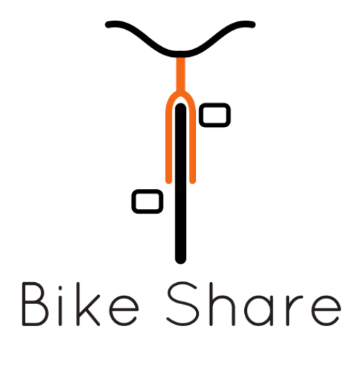

  

# Universidad Peruana de Ciencias Aplicadas

## Carrera de Ingeniería de Software

Ciclo: 2025 - 0 1

Curso: Desarrollo de Aplicaciones Open Source 

Sección: 1ASI0729-2510-4313

Profesor: Alberto Wilmer Sanchez Seña

“Informe de Trabajo Final”

Startup: RepoRangers

Producto: BikeShare

|          Integrantes           |   Código   |
| :----------------------------: | :--------: |
|      Rodrigo Alaya Cabrera      | U202219481 |
|      Niurka Lucero Huarcaya Quispe       | U20...... |
|      José Luis Martinez Valdivia         | U20..... |
|      Maria Fernanda Mostajo Orosco       | U202312874 |
|      Karen Stephanie Ramos Carpio          | U20201e493 |

Abril 2025

# **Registro de Versiones**

<table>
  <thead>
    <tr>
        <th>Versión</th>
        <th>Fecha</th>
        <th>Autor</th>
        <th>Descripción de modificación</th>
    </tr>
  </thead>
  <tbody>
  <tr>
      <td><strong>TB1</strong></td>
      <td>Abril</td>
      <td>
        <ul>
            <li>Rodrigo Alaya Cabrera </li> 
            <li>Niurka Lucero Huarcaya Quispe </li> 
            <li>José Luis Martinez Valdivia</li> 
            <li>Maria Fernanda Mostajo Orosco</li> 
            <li>Karen Stephanie Ramos Carpio</li> 
        </ul>
      </td>
      <td>
        Se han incluído los siguientes capítulos:
        <ul>
          <li>Capítulo I: Introducción</li>
          <li>Capítulo II: Requirements Elicitation & Analysis</li>
          <li>Capítulo III: Requirements Specification</li>
          <li>Capítulo IV: Product Design</li>
          <li>Avance del Capítulo V: Product Implementation, Validation & Deployment hasta el punto 5.2.1.8 Sprint 1</li>
          <li>Avance de Conclusiones, Bibliografía y Anexos</li>
        </ul>
      </td>
  </tr>
  </tbody>
</table>

# **Project Report Collaboration Insights**

 
 
 
 

# **Student Outcomes**
<table style="border-collapse: collapse; width: 100%; border: 1px solid black;">
  <thead>
    <tr style="border-bottom: 1px solid black;">
      <th style="border-right: 1px solid black;">Criterio Específico</th>
      <th style="border-right: 1px solid black;">Acciones Realizadas</th>
      <th>Conclusiones</th>
    </tr>
  </thead>
    <tbody>
    <tr style="border-bottom: 1px solid black;">
      <td style="border-right: 1px solid black;"><strong>Comunica oralmente con efectividad a diferentes rangos de audiencia. </strong></td>
      <td style="border-right: 1px solid black;">
        <ul>
          
<strong>TB1</strong>

        </ul>
          <td> </td>
       
     </tr>
      <tr style="border-bottom: 1px solid black;">
      <td style="border-right: 1px solid black;"><strong>Comunica por escrito con efectividad a diferentes rangos de audiencia.</strong></td>
      <td style="border-right: 1px solid black;">
        <ul>
          
<strong>TB1</strong>

        </ul>
	        <td> </td>
       
     </tr>
  </tbody>
</table>

# **Project Report Online**

URL Project Report (Github): https://github.com/upc-pre-2025101asi0729-RepoRangers/Report

### [Capítulo I: Introducción]()
- [1.1. Startup Profile]()
    - [1.1.1 Descripción de la Startup]()
    - [1.1.2 Perfiles de integrantes del equipo]()
- [1.2 Solution Profile]()
    - [1.2.1 Antecedentes y problemática]()
    - [1.2.2 Lean UX Process]()
        - [1.2.2.1. Lean UX Problem Statements]()
        - [1.2.2.2. Lean UX Assumptions]()
        - [1.2.2.3. Lean UX Hypothesis Statements]()
        - [1.2.2.4. Lean UX Canvas]()
- [1.3. Segmentos objetivo]()

### [Capítulo II: Requirements Elicitation & Analysis]()
- [2.1. Competidores]()
    - [2.1.1. Análisis competitivo]()
    - [2.1.2. Estrategias y tácticas frente a competidores]()
- [2.2. Entrevistas]()
    - [2.2.1. Diseño de entrevistas]()
    - [2.2.2. Registro de entrevistas]()
    - [2.2.3. Análisis de entrevistas]()
- [2.3. Needfinding]()
    - [2.3.1. User Personas]()
    - [2.3.2. User Task Matrix]()
    - [2.3.3. User Journey Mapping]()
    - [2.3.4. Empathy Mapping]()
    - [2.3.5. As-is Scenario Mapping]()
- [2.4. Ubiquitous Language]()

### [Capítulo III: Requirements Specification]()
- [3.1. To-Be Scenario Mapping]()
- [3.2. User Stories]()
- [3.3. Impact Mapping]()
- [3.4. Product Backlog]()

### [Capítulo IV: Product Design]()
- [4.1. Style Guidelines]()
    - [4.1.1. General Style Guidelines]()
    - [4.1.2. Web Style Guidelines]()
- [4.2. Information Architecture]()
    - [4.2.1. Organization Systems]()
    - [4.2.2. Labeling Systems]()
    - [4.2.3. SEO Tags and Meta Tags]()
    - [4.2.4. Searching Systems]()
    - [4.2.5. Navigation Systems]()
- [4.3. Landing Page UI Design]()
    - [4.3.1. Landing Page Wireframe]()
    - [4.3.2. Landing Page Mock-up]()
- [4.4. Web Applications UX/UI Design]()
    - [4.4.1. Web Applications Wireframes]()
    - [4.4.2. Web Applications Wireflow Diagrams]()
    - [4.4.3. Web Applications Mock-ups]()
    - [4.4.4. Web Applications User Flow Diagrams]()
- [4.5. Web Applications Prototyping]()
- [4.6. Domain-Driven Software Architecture]()
    - [4.6.1. Software Architecture Context Diagram]()
    - [4.6.2. Software Architecture Container Diagrams]()
    - [4.6.3. Software Architecture Components Diagrams]()
- [4.7. Software Object-Oriented Design]()
    - [4.7.1. Class Diagrams]()
    - [4.7.2. Class Dictionary]()
- [4.8. Database Design]()
    - [4.8.1. Database Diagram]()

### [Capítulo V: Product Implementation, Validation & Deployment]()
- [5.1. Software Configuration Management]()
    - [5.1.1. Software Development Environment Configuration]()
    - [5.1.2. Source Code Management]()
    - [5.1.3. Source Code Style Guide & Conventions]()
    - [5.1.4. Software Deployment Configuration]()
- [5.2. Landing Page, Services & Applications Implementation]()
    - [5.2.1. Sprint 1]()
        - [5.2.1.1. Sprint Planning 1]()
        - [5.2.1.2. Sprint Backlog 1]()
        - [5.2.1.3. Development Evidence for Sprint Review]()
        - [5.2.1.4. Testing Suite Evidence for Sprint Review]()
        - [5.2.1.5. Execution Evidence for Sprint Review]()
        - [5.2.1.6. Services Documentation Evidence for Sprint Review]()
        - [5.2.1.7. Software Deployment Evidence for Sprint Review]()
        - [5.2.1.8. Team Collaboration Insights during Sprint]()

---
# Capítulo I: Introducción
## 1.1. Startup Profile

Esta sección proporciona una visión integral de la startup, incluyendo una descripción detallada de su misión, visión, y el producto que ofrece. Además, se presentan los perfiles de los miembros clave del equipo, destacando sus habilidades, experiencia y contribuciones al desarrollo y éxito de la empresa. Aquí se busca brindar una comprensión completa de la identidad y el potencial del startup, así como de las personas que impulsan su crecimiento.

### 1.1.1 Descripción de la Startup

Bikeshare es una plataforma web colaborativa que permite a los usuarios alquilar o rentar bicicletas entre sí de manera segura, flexible y eficiente. La aplicación integra geolocalización en tiempo real, ofreciendo un mapa interactivo donde los usuarios pueden visualizar bicicletas disponibles y zonas seguras para la entrega y devolución. A través de un sistema de reservas con cobro automático y pagos en línea, se garantiza una experiencia fluida y confiable para ambas partes. Además, Bikeshare incorpora un sistema de reputación basado en calificaciones y comentarios, fomentando la confianza entre arrendadores y arrendatarios. Este enfoque combina tecnología y comunidad para promover una movilidad sostenible y compartida en entornos urbanos.

**Misión:** Promover una movilidad urbana sostenible, accesible y colaborativa a través de una plataforma digital que conecta personas para el alquiler seguro y flexible de bicicletas, integrando tecnología de geolocalización, pagos en línea y un sistema de reputación que garantiza confianza y transparencia en cada viaje.

**Visión:** Convertirnos en la solución líder de micromovilidad compartida en el Perú, transformando la forma en que las personas se desplazan en las ciudades mediante una red comunitaria de bicicletas conectadas, seguras y disponibles en tiempo real, fomentando una cultura de transporte responsable y ecológico.

**Logo del Startup:**

**Logo del Producto:**

### 1.1.2 Perfiles de integrantes del equipo

<TABLE BORDER>
	<TR>
		<TH><h2>Intregantes</h2></TH> 
		<TH><h2>Descripción</h2></TH>
		<TH><h2>Conocimientos</h2></TH>
	</TR>
<tr>
  <td style="text-align: center" align="center">
    

      Rodrigo Alaya - U202219481  
       
      
    

  </td>
  <td style="text-align: center" align="center">
    Soy una persona responsable, comprometida con mis objetivos y con gran disposición para aprender continuamente. Me adapto con facilidad al trabajo en equipo, aportando ideas y soluciones. Valoro mucho la eficiencia, la ética profesional y la mejora constante. Me esfuerzo por entregar siempre resultados de calidad, gestionando mis tareas con orden y enfoque.
  </td>
  <td style="text-align: center" align="center">
    Apasionado por el desarrollo de software y la resolución de problemas. Tengo conocimientos en C++, Python, HTML, CSS y otros lenguajes de programación. Me considero autodidacta, siempre en busca de nuevos retos para fortalecer mis habilidades técnicas. También me interesa la experiencia del usuario y el diseño centrado en las personas como parte esencial en la creación de soluciones tecnológicas.
  </td>
</tr>
  	<TR>
		<td style="text-align: center" align="center">
 Niurka Lucero Huarcaya Quispe - U20   
</td> 
		<td style="text-align: center" align="center"></td>
		<td style="text-align: center" align="center"></td>
	</TR>
	<TR>
		<td style="text-align: center" align="center">
 José Luis Martinez Valdivia - U20   
</td> 
		<td style="text-align: center" align="center"></td>
		<td style="text-align: center" align="center"> </td>
	</TR>
  	<TR>
		<td style="text-align: center" align="center">
 Maria Fernanda Mostajo Orosco - U202312874   
</td> 
		<td style="text-align: center" align="center"></td>
		<td style="text-align: center" align="center"></td>
	</TR>
	<TR>
		<td style="text-align: center" align="center">
 Karen Ramos Carpio - U20201E493  
</td>
		<td style="text-align: center" align="center">Cuento con gran capacidad de autoaprendizaje, esto me permite alcanzar mejores índices de productividad para la empresa de forma individual como en trabajo en 		equipo para poder llegar a los objetivos definidos por la empresa.Tengo un alto sentido del compromiso y la responsabilidad por lo que puedo garantizar que la tarea que me sea asignada será gestionada con 		diligencia.</td>
		<td style="text-align: center" align="center">Desarrollador entusiasta de resolución de problemas de .NET con experiencia en C#, JavaScript, TypeScript, Golang, C++, HTML CSS. Además de .NET, .Net Core, 		Angular, React y Kendo UI.Trabaja bien tanto individualmente como en un ambiente de equipo. Como profesional de TI, me dedico a administrar mis proyectos hasta su finalización, asegurándose de que se 		completen en el plazo establecido</td>
	</TR>
</TABLE>
