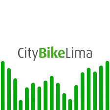
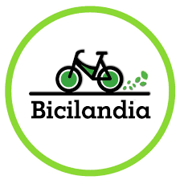
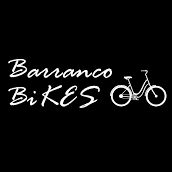

  

# Universidad Peruana de Ciencias Aplicadas

## Carrera de Ingeniería de Software

Ciclo: 2025 - 0 1

Curso: Desarrollo de Aplicaciones Open Source 

Sección: 1ASI0729-2510-4313

Profesor: Alberto Wilmer Sanchez Seña

“Informe de Trabajo Final”

Startup: RepoRangers

Producto: BikeShare

|          Integrantes           |   Código   |
| :----------------------------: | :--------: |
|      Rodrigo Alaya Cabrera      | U202219481 |
|      Niurka Lucero Huarcaya Quispe       | U20...... |
|      José Luis Martinez Valdivia         | U20..... |
|      Maria Fernanda Mostajo Orosco       | U20...... |
|      Karen Stephanie Ramos Carpio          | U20201e493 |

Abril 2025

# **Registro de Versiones**

<table>
  <thead>
    <tr>
        <th>Versión</th>
        <th>Fecha</th>
        <th>Autor</th>
        <th>Descripción de modificación</th>
    </tr>
  </thead>
  <tbody>
  <tr>
      <td><strong>TB1</strong></td>
      <td>Abril</td>
      <td>
        <ul>
            <li>Rodrigo Alaya Cabrera </li> 
            <li>Niurka Lucero Huarcaya Quispe </li> 
            <li>José Luis Martinez Valdivia</li> 
            <li>Maria Fernanda Mostajo Orosco</li> 
            <li>Karen Stephanie Ramos Carpio</li> 
        </ul>
      </td>
      <td>
        Se han incluído los siguientes capítulos:
        <ul>
          <li>Capítulo I: Introducción</li>
          <li>Capítulo II: Requirements Elicitation & Analysis</li>
          <li>Capítulo III: Requirements Specification</li>
          <li>Capítulo IV: Product Design</li>
          <li>Avance del Capítulo V: Product Implementation, Validation & Deployment hasta el punto 5.2.1.8 Sprint 1</li>
          <li>Avance de Conclusiones, Bibliografía y Anexos</li>
        </ul>
      </td>
  </tr>
  </tbody>
</table>

# **Project Report Collaboration Insights**

 
 
 
 

# **Student Outcomes**
<table style="border-collapse: collapse; width: 100%; border: 1px solid black;">
  <thead>
    <tr style="border-bottom: 1px solid black;">
      <th style="border-right: 1px solid black;">Criterio Específico</th>
      <th style="border-right: 1px solid black;">Acciones Realizadas</th>
      <th>Conclusiones</th>
    </tr>
  </thead>
    <tbody>
    <tr style="border-bottom: 1px solid black;">
      <td style="border-right: 1px solid black;"><strong>Comunica oralmente con efectividad a diferentes rangos de audiencia. </strong></td>
      <td style="border-right: 1px solid black;">
        <ul>
          
<strong>TB1</strong>

        </ul>
          <td> </td>
       
     </tr>
      <tr style="border-bottom: 1px solid black;">
      <td style="border-right: 1px solid black;"><strong>Comunica por escrito con efectividad a diferentes rangos de audiencia.</strong></td>
      <td style="border-right: 1px solid black;">
        <ul>
          
<strong>TB1</strong>

        </ul>
	        <td> </td>
       
     </tr>
  </tbody>
</table>

# **Project Report Online**

URL Project Report (Github): https://github.com/upc-pre-2025101asi0729-RepoRangers/Report

### [Capítulo I: Introducción]()
- [1.1. Startup Profile]()
    - [1.1.1 Descripción de la Startup]()
    - [1.1.2 Perfiles de integrantes del equipo]()
- [1.2 Solution Profile]()
    - [1.2.1 Antecedentes y problemática]()
    - [1.2.2 Lean UX Process]()
        - [1.2.2.1. Lean UX Problem Statements]()
        - [1.2.2.2. Lean UX Assumptions]()
        - [1.2.2.3. Lean UX Hypothesis Statements]()
        - [1.2.2.4. Lean UX Canvas]()
- [1.3. Segmentos objetivo]()

### [Capítulo II: Requirements Elicitation & Analysis]()
- [2.1. Competidores]()
  - [2.1.1. Análisis competitivo]()
  - [2.1.2. Estrategias y tácticas frente a competidores]()
- [2.2. Entrevistas]()
    - [2.2.1. Diseño de entrevistas]()
    - [2.2.2. Registro de entrevistas]()
    - [2.2.3. Análisis de entrevistas]()
- [2.3. Needfinding]()
    - [2.3.1. User Personas]()
    - [2.3.2. User Task Matrix]()
    - [2.3.3. User Journey Mapping]()
    - [2.3.4. Empathy Mapping]()
    - [2.3.5. As-is Scenario Mapping]()
- [2.4. Ubiquitous Language]()

### [Capítulo III: Requirements Specification]()
- [3.1. To-Be Scenario Mapping]()
- [3.2. User Stories]()
- [3.3. Impact Mapping]()
- [3.4. Product Backlog]()

### [Capítulo IV: Product Design]()
- [4.1. Style Guidelines]()
    - [4.1.1. General Style Guidelines]()
    - [4.1.2. Web Style Guidelines]()
- [4.2. Information Architecture]()
    - [4.2.1. Organization Systems]()
    - [4.2.2. Labeling Systems]()
    - [4.2.3. SEO Tags and Meta Tags]()
    - [4.2.4. Searching Systems]()
    - [4.2.5. Navigation Systems]()
- [4.3. Landing Page UI Design]()
    - [4.3.1. Landing Page Wireframe]()
    - [4.3.2. Landing Page Mock-up]()
- [4.4. Web Applications UX/UI Design]()
    - [4.4.1. Web Applications Wireframes]()
    - [4.4.2. Web Applications Wireflow Diagrams]()
    - [4.4.3. Web Applications Mock-ups]()
    - [4.4.4. Web Applications User Flow Diagrams]()
- [4.5. Web Applications Prototyping]()
- [4.6. Domain-Driven Software Architecture]()
    - [4.6.1. Software Architecture Context Diagram]()
    - [4.6.2. Software Architecture Container Diagrams]()
    - [4.6.3. Software Architecture Components Diagrams]()
- [4.7. Software Object-Oriented Design]()
    - [4.7.1. Class Diagrams]()
    - [4.7.2. Class Dictionary]()
- [4.8. Database Design]()
    - [4.8.1. Database Diagram]()

### [Capítulo V: Product Implementation, Validation & Deployment]()
- [5.1. Software Configuration Management]()
    - [5.1.1. Software Development Environment Configuration]()
    - [5.1.2. Source Code Management]()
    - [5.1.3. Source Code Style Guide & Conventions]()
    - [5.1.4. Software Deployment Configuration]()
- [5.2. Landing Page, Services & Applications Implementation]()
    - [5.2.1. Sprint 1]()
        - [5.2.1.1. Sprint Planning 1]()
        - [5.2.1.2. Sprint Backlog 1]()
        - [5.2.1.3. Development Evidence for Sprint Review]()
        - [5.2.1.4. Testing Suite Evidence for Sprint Review]()
        - [5.2.1.5. Execution Evidence for Sprint Review]()
        - [5.2.1.6. Services Documentation Evidence for Sprint Review]()
        - [5.2.1.7. Software Deployment Evidence for Sprint Review]()
        - [5.2.1.8. Team Collaboration Insights during Sprint]()
---
### [Capítulo II: Requirements Elicitation & Analysis]()
- [2.1. Competidores]()
  - [2.1.1. Análisis competitivo]()

    **¿Por qué llevar a cabo este análisis?**  
    Este análisis permite conocer mejor a los competidores actuales en el sector de alquiler de bicicletas en Lima Metropolitana, identificar sus fortalezas y debilidades, y establecer estrategias efectivas para que BikeShare se posicione con ventaja competitiva en el mercado local.

    | **Categoría** | **BikeShare**  | **CityBike Lima**  | **Bicilandia**  | **Barranco Bikes**  |
    |---------------|---------------|-------------------|----------------|---------------------|
    | **Overview** | Plataforma colaborativa digital para alquiler de bicicletas entre ciudadanos en Lima Metropolitana. | Sistema de bicicletas públicas con estaciones fijas en Miraflores. | Alquiler tradicional de bicicletas desde locales físicos en zonas turísticas. | Alquiler de bicicletas y tours guiados con servicio de entrega a domicilio. |
    | **Ventaja competitiva** ¿Qué valor ofrece a los clientes? | Fomenta la economía colaborativa, acceso flexible y sin estaciones físicas, geolocalización y pagos integrados. | Conveniencia, integración con infraestructura urbana, tecnología móvil. | Accesibilidad y bajo costo para turistas sin tecnología. | Enfoque turístico personalizado y servicio de entrega. |
    | **Mercado objetivo** | Jóvenes, estudiantes, trabajadores urbanos, 18-40 años, con conciencia ecológica. | Residentes y visitantes de Miraflores. | Turistas y visitantes temporales. | Turistas y residentes recreativos en Barranco. |
    | **Estrategias de marketing** | Campañas digitales, redes sociales, alianzas con universidades y colectivos ciclistas. | Promoción local, presencia visual en espacios públicos. | Promociones físicas y boca a boca, descuentos estudiantiles. | Presencia en redes, contacto directo, convenios turísticos. |
    | **Productos & Servicios** | Alquiler entre usuarios, reservas, pagos online, historial y sistema de reputación. | Bicicletas propias con estaciones automatizadas. | Bicicletas mecánicas sin reservas ni tecnología. | Alquiler, tours, clases de surf con entrega de bicis. |
    | **Precios & Costos** | Microtransacción (~10%) por alquiler, con planes premium futuros. | Tarifas por pase diario, mensual y anual con tiempo limitado por viaje. | Precio por hora, con promociones para estudiantes. | Costos por horas/tours, según actividad contratada. |
    | **Canales de distribución (Web/Móvil)** | Web app accesible desde cualquier navegador con conexión. | App móvil para registro y desbloqueo de bicicletas. | Presencial, sin canal digital. | Redes sociales, WhatsApp y reservas por teléfono. |
    | **Fortalezas** | Escalable, sin flota propia, promueve comunidad y sostenibilidad. | Infraestructura consolidada, operación fluida. | Costo operativo bajo, fácil acceso local. | Atención personalizada, nicho turístico. |
    | **Debilidades** | Base de usuarios aún en construcción, requiere confianza entre pares. | Cobertura limitada a un distrito, dependencia de estaciones. | Sin escalabilidad, sin presencia digital. | Cobertura limitada y sin plataforma digital robusta. |
    | **Oportunidades** | Impulso municipal al ciclismo, tendencia ecológica urbana. | Iniciativas distritales en transporte ecológico. | Turismo activo en Miraflores y Jesús María. | Turismo recreativo y cultural en Barranco. |
    | **Amenazas** | Competencia con apps ya establecidas, resistencia inicial de usuarios. | Limitado potencial de expansión sin inversión en estaciones. | Perder mercado ante plataformas tecnológicas. | Falta de escalabilidad y dependencia de comunicación directa. |

  - [2.1.2. Estrategias y tácticas frente a competidores]()
    
    BikeShare, al operar en un mercado donde ya existen soluciones tradicionales y semi-digitales de alquiler de bicicletas, debe aplicar estrategias que le permitan posicionarse como una alternativa innovadora, segura y sostenible. A continuación, se detallan las estrategias y tácticas            preliminares para afrontar las fortalezas y debilidades de los competidores, así como para aprovechar las oportunidades y mitigar las amenazas presentes en el entorno competitivo.

#### Frente a las fortalezas de los competidores

| **Fortalezas de los competidores**                                                                 | **Estrategias de BikeShare**                                                                                     |
|----------------------------------------------------------------------------------------------------|------------------------------------------------------------------------------------------------------------------|
| CityBike Lima cuenta con infraestructura consolidada y estaciones automatizadas.                  | Diferenciación mediante un modelo sin estaciones fijas, que permita flexibilidad en el retiro y entrega de bicicletas. |
| Bicilandia ofrece precios accesibles y presencia en zonas turísticas.                              | Implementar tarifas dinámicas y descuentos por uso frecuente, con un sistema de pago transparente.               |
| Barranco Bikes brinda atención personalizada y tours guiados.                                      | Establecer alianzas con guías locales y operadores turísticos para integrar experiencias dentro de la plataforma. |

#### Frente a las debilidades de los competidores

| **Debilidades de los competidores**                                                                | **Tácticas de BikeShare**                                                                                          |
|----------------------------------------------------------------------------------------------------|--------------------------------------------------------------------------------------------------------------------|
| Cobertura geográfica limitada a ciertos distritos.                                                 | Escalabilidad sin necesidad de infraestructura física, ampliando cobertura rápidamente mediante usuarios.          |
| Ausencia de digitalización (Bicilandia).                                                           | Plataforma 100% digital con geolocalización, reservas, pagos y reputación.                                         |
| Alta dependencia del contacto directo para coordinar servicios (Barranco Bikes).                   | Automatización de procesos: reservas instantáneas, notificaciones inteligentes y sistema de calificaciones.        |

#### Aprovechamiento de oportunidades del entorno

| **Oportunidades del entorno**                                                                      | **Estrategias para capitalizarlas**                                                                                 |
|----------------------------------------------------------------------------------------------------|----------------------------------------------------------------------------------------------------------------------|
| Mayor conciencia ecológica y apoyo municipal a la bicicleta.                                       | Campañas de sensibilización y alianzas con municipios y eventos de movilidad sostenible.                             |
| Tendencia al uso de soluciones digitales y autoservicio.                                           | Enfocar el desarrollo en una plataforma accesible, intuitiva y confiable desde cualquier dispositivo.                |

#### Mitigación de amenazas del entorno

| **Amenazas externas**                                                                              | **Tácticas de mitigación**                                                                                           |
|----------------------------------------------------------------------------------------------------|----------------------------------------------------------------------------------------------------------------------|
| Competencia de plataformas consolidadas.                                                           | Posicionarse como alternativa colaborativa y más flexible para trayectos cortos o recreativos.                      |
| Desconfianza en el alquiler entre pares.                                                           | Implementar validación de identidad, calificaciones y sistema de soporte a usuarios.                                 |
| Resistencia cultural al uso de bicicleta en algunos distritos.                                     | Desarrollar campañas educativas en redes sociales y brindar incentivos para primeros usuarios.                       |

 #### Estrategia general

BikeShare se posicionará como una solución colaborativa, ecológica y digital, dirigida a ciudadanos que buscan alternativas de transporte accesibles, sostenibles y fáciles de usar. Gracias a su modelo descentralizado, la plataforma puede escalar rápidamente sin depender de infraestructura 
física, diferenciándose de la competencia tradicional. A través de su enfoque en experiencia de usuario, comunidad y sostenibilidad urbana, BikeShare aprovechará las oportunidades del mercado para consolidarse como un referente de movilidad compartida en Lima Metropolitana.

- [2.2. Entrevistas]()
  
  Las entrevistas son una herramienta clave para obtener información cualitativa sobre los usuarios potenciales de la plataforma. A través de ellas, se busca conocer sus opiniones, hábitos, necesidades y expectativas en relación al alquiler o renta de bicicletas en Lima Metropolitana. Esta 
  información es esencial para definir arquetipos y mejorar el enfoque del diseño centrado en el usuario.
  
  - [2.2.1. Diseño de entrevistas]()
    
    Para cada uno de los segmentos identificados, se han formulado las siguientes preguntas:

    #### Segmento #1: Personas interesadas en alquilar bicicletas (Arrendatarios)

     - ¿Cuál es su nombre, edad y en qué distrito vive?
     - ¿Con qué frecuencia se moviliza por la ciudad y qué medios de transporte utiliza normalmente?
     - ¿Ha alquilado bicicletas anteriormente? ¿Dónde y cómo fue su experiencia?
     - ¿En qué situaciones estaría dispuesto/a a alquilar una bicicleta?
     - ¿Qué características considera necesarias en una app para sentirse seguro/a alquilando bicicletas?
     - ¿Qué métodos de pago utiliza con mayor frecuencia? ¿Le resultaría cómodo pagar mediante una app?
     - ¿Qué tan importante es para usted conocer la reputación del arrendador antes de hacer el alquiler?
     - ¿Prefiere alquilar por tiempo, por trayecto o por distancia? ¿Por qué?
     - ¿Ha tenido experiencias negativas al usar servicios de transporte urbano? ¿Cuáles?
     - ¿Qué dispositivo usa con más frecuencia (smartphone, laptop, tablet)?
     - ¿Cuáles son sus principales frustraciones al movilizarse por la ciudad?
     - ¿Qué expectativas tendría sobre una app de alquiler de bicicletas entre personas?

    #### Segmento #2: Personas dispuestas a rentar sus bicicletas (Arrendadores)

     - ¿Cuál es su nombre, edad y en qué distrito vive?
     - ¿Tiene bicicleta propia? ¿Con qué frecuencia la usa?
     - ¿Alguna vez ha pensado en rentar su bicicleta? ¿Qué le motivaría a hacerlo?
     - ¿Qué aspectos le generarían desconfianza al compartir su bicicleta con desconocidos?
     - ¿Qué tan importante es para usted controlar el precio, horario y condiciones del alquiler?
     - ¿Qué medidas de seguridad consideraría necesarias para sentirse tranquilo al prestar su bicicleta?
     - ¿Qué tipo de alertas o notificaciones le gustaría recibir cuando alguien solicite su bicicleta?
     - ¿Está familiarizado con aplicaciones colaborativas (como Airbnb, Rappi, etc.)? ¿Las ha usado antes?
     - ¿Qué métodos de pago prefiere para recibir ingresos por el alquiler?
     - ¿Qué tipo de soporte o ayuda esperaría de parte de la plataforma en caso de incidentes?
     - ¿Qué beneficios esperaría obtener por formar parte de una comunidad colaborativa de movilidad?
     - ¿Qué le haría recomendar esta app a otros dueños de bicicleta?
  - [2.2.2. Registro de entrevistas]()
