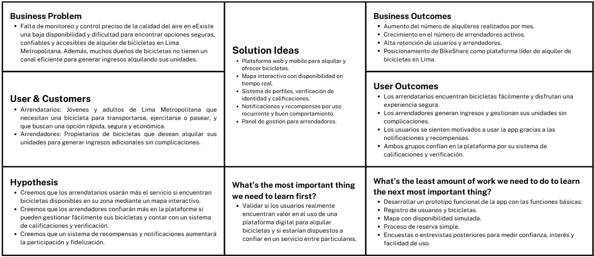

## 1.1. Startup Profile

### 1.1.1. Descripción de la Startup

BikeShare es una plataforma innovadora que busca transformar la movilidad urbana mediante la economía colaborativa y el uso de tecnología avanzada. Nuestra aplicación web permite a los usuarios alquilar o rentar bicicletas entre sí para trayectos urbanos, recreativos o de transporte diario.

La plataforma integra funciones de geolocalización, pagos en línea, reservas y un sistema de reputación, que garantizan una experiencia de uso segura, flexible y transparente. Los usuarios tienen el control total sobre el precio, la disponibilidad y las condiciones de uso de sus bicicletas.

Como empresa emergente, en RepoRangers estamos comprometidos con la sostenibilidad, la innovación tecnológica y la creación de comunidades conectadas. Nuestro objetivo es ofrecer una solución accesible y eficiente que promueva el uso compartido de bicicletas como una alternativa al transporte tradicional, reduciendo el impacto ambiental y mejorando la calidad de vida en las ciudades.

**Misión:** Promover una movilidad urbana sostenible, accesible y colaborativa a través de una plataforma digital que conecta personas para el alquiler seguro y flexible de bicicletas, integrando tecnología de geolocalización, pagos en línea y un sistema de reputación que garantiza confianza y transparencia en cada viaje.

**Visión:** Convertirnos en la solución líder de micromovilidad compartida en el Perú, transformando la forma en que las personas se desplazan en las ciudades mediante una red comunitaria de bicicletas conectadas, seguras y disponibles en tiempo real, fomentando una cultura de transporte responsable y ecológico.

### 1.1.2. Perfiles de los Integrantes

<TABLE BORDER>
	<TR>
		<TH><h2>Intregantes</h2></TH> 
		<TH><h2>Descripción</h2></TH>
		<TH><h2>Conocimientos</h2></TH>
	</TR>
  	<TR>
		<td style="text-align: center" align="center">
 Rodrigo Alaya Cabrera - U20   
</td> 
		<td style="text-align: center" align="center"></td>
		<td style="text-align: center" align="center"> </td>
	</TR>
  	<TR>
		<td style="text-align: center" align="center">
 Niurka Lucero Huarcaya Quispe - U20   
</td> 
		<td style="text-align: center" align="center"></td>
		<td style="text-align: center" align="center"></td>
	</TR>
	<TR>
		<td style="text-align: center" align="center">
 José Luis Martinez Valdivia - U20   
</td> 
		<td style="text-align: center" align="center"></td>
		<td style="text-align: center" align="center"> </td>
	</TR>
  	<TR>
		<td style="text-align: center" align="center">
 Maria Fernanda Mostajo  - U202312874   
</td> 
		<td style="text-align: center" align="center">Mi nombre es Maria Fernanda Mostajo, estoy estudiando la carrera de Ingeniería de Software en la UPC, me considero una persona responsable, amable, puntual y con gran capacidad de trabajar en equipo. Asimismo, me comprometo a apoyar a mi equipo en todo el proceso de nuestro trabajo y tambien generando ideas para poder mejorar nuestra propuesta. </td>
		<td style="text-align: center" align="center">Tengo conocimientos en los lenguajes de programación C++, Python, HTML, CSS, JavaScript y SQL. Además, cuento con habilidades de trabajo en equipo, el cual me permitira realizar un buen trabajo y cumplir con los objetivos planteados en el tiempo establecido. </td>
	</TR>
	<TR>
		<td style="text-align: center" align="center">
 Karen Ramos Carpio - U20201E493  
</td>
		<td style="text-align: center" align="center">Cuento con gran capacidad de autoaprendizaje, esto me permite alcanzar mejores índices de productividad para la empresa de forma individual como en trabajo en 		equipo para poder llegar a los objetivos definidos por la empresa.Tengo un alto sentido del compromiso y la responsabilidad por lo que puedo garantizar que la tarea que me sea asignada será gestionada con 		diligencia.</td>
		<td style="text-align: center" align="center">Desarrollador entusiasta de resolución de problemas de .NET con experiencia en C#, JavaScript, TypeScript, Golang, C++, HTML CSS. Además de .NET, .Net Core, 		Angular, React y Kendo UI.Trabaja bien tanto individualmente como en un ambiente de equipo. Como profesional de TI, me dedico a administrar mis proyectos hasta su finalización, asegurándose de que se 		completen en el plazo establecido</td>
	</TR>
</TABLE>

## 1.2. Solution Profile

BikeShare es una plataforma web innovadora, diseñada para facilitar el alquiler de bicicletas entre usuarios en Lima Metropolitana, promoviendo una movilidad urbana sostenible y colaborativa. A través de una interfaz intuitiva y un mapa interactivo, permite a los ciudadanos encontrar bicicletas disponibles cerca de su ubicación o poner las suyas en alquiler, estableciendo el precio, la disponibilidad y las condiciones de uso. Gracias a su diseño accesible, BikeShare permite que cualquier persona pueda utilizarla sin dificultad, fomentando el uso compartido de bicicletas como una alternativa ecológica al transporte tradicional y contribuyendo a reducir el tráfico y la contaminación en la ciudad.

### 1.2.1. Antecedentes y Problemática

**WHAT?**

- ¿Cuál es el problema?

	La falta de acceso flexible, económico y sostenible a medios de transporte personal en la ciudad, así como el desaprovechamiento de bicicletas no utilizadas.

- ¿Cuál es la relación con la persona en cuestión?

	Buscamos ofrecer a los ciudadanos una solución práctica para desplazarse de forma más eficiente y sostenible. Asimismo, ayudamos a los propietarios de bicicletas a obtener ingresos adicionales a través del alquiler de sus vehículos.

**WHEN?**

- ¿Cuándo sucede el problema?

	El problema ocurre cuando las personas necesitan movilizarse dentro de la ciudad y no encuentran opciones accesibles o cómodas, especialmente en horas punta o zonas con poco transporte público.

- ¿Cuándo utiliza el cliente el producto?

	El cliente usa BikeShare cuando desea alquilar una bicicleta para moverse por la ciudad, ya sea para ir al trabajo, estudiar, hacer ejercicio o pasear, en momentos puntuales o como rutina diaria.

**WHERE?**

- ¿Dónde está el cliente cuando usa el producto?

	Desde cualquier lugar con acceso a internet: su casa, trabajo, universidad, parque, estacionamiento o incluso en plena calle.

- ¿A dónde se dirige?

	Nuestro producto se dirige a los ciudadanos de Lima Metropolitana interesados en alternativas de transporte urbano sostenibles y accesibles. En particular, está enfocado en dos públicos: los arrendatarios, que buscan alquilar bicicletas para movilizarse de manera práctica, económica y ecológica; y los arrendadores, que desean rentabilizar sus bicicletas personales cuando no las utilizan. Ambos perfiles encuentran en BikeShare una plataforma segura y eficiente para satisfacer sus necesidades de transporte o generar ingresos adicionales.

- ¿Dónde surge el problema?

	El problema surge en zonas urbanas con tráfico denso, pocas ciclovías o donde los usuarios no tienen medios de transporte propios ni acceso fácil a alternativas limpias.

**WHO?**

- ¿Quiénes están involucrados?

	Ciudadanos con bicicletas en desuso, usuarios que necesitan transportarse, autoridades municipales interesadas en soluciones sostenibles

- ¿A quiénes le sucede el problema?

	A ciudadanos sin medios propios de transporte o que buscan opciones más económicas, rápidas y ecológicas. También a propietarios que desean rentabilizar sus bicicletas.

- ¿Quién lo utilizará?

	Jóvenes, estudiantes, trabajadores, turistas y cualquier persona interesada en una movilidad urbana eficiente y amigable con el medio ambiente.

**WHY?**

- ¿Cuál es la causa del problema?
	
	El transporte público es limitado, lento o incómodo, y el uso de autos particulares contribuye al tráfico y la contaminación. Además, muchas bicicletas permanecen almacenadas sin uso y sin generar valor.

**HOW?**

- ¿En qué condiciones los clientes usan nuestro producto?

	Cuando necesitan transportarse por trayectos cortos o medianos sin depender de transporte público o taxis. También cuando quieren evitar el tráfico o practicar una movilidad más saludable.

- ¿Cómo nos conocieron los compradores?

	A través de campañas en redes sociales, alianzas con universidades o municipios, y por recomendaciones de otros usuarios.

- ¿Cómo prefieren los lectores acceder a nuestro contenido?

	Mediante nuestra app web, que ofrece una interfaz intuitiva, información clara, y acceso rápido a bicicletas cercanas.

- ¿Qué llevó a la persona a llegar a esta situación?

	La necesidad de encontrar un medio de transporte alternativo, económico, rápido o saludable, así como el interés en aprovechar recursos infrautilizados como bicicletas personales.

**HOW MUCH?**

• La congestión vehicular en Lima genera pérdidas anuales de aproximadamente S/2 mil millones en productividad, según el Instituto Peruano de Economía (IPE, 2023). En hora punta, recorrer 10 km puede tomar hasta 33 minutos, afectando directamente la calidad de vida de los ciudadanos.
Actualmente, solo el 3% de los limeños usa bicicleta como medio de transporte, según un estudio de la Municipalidad de Lima. Aumentar este porcentaje puede traer beneficios significativos en movilidad y salud.
BikeShare busca ser parte de la solución, promoviendo el uso de bicicletas compartidas para reducir el tráfico, mejorar la movilidad y generar impacto positivo en el entorno urbano.

### 1.2.2. Lean UX Process

El lean UX es un enfoque de diseño que se centra en la eficiencia y la adaptabilidad, buscando crear productos y servicios que respondan de manera efectiva a las verdaderas necesidades de los usuarios. Este método enfatiza la colaboración entre equipos, la recopilación constante de feedback y la iteración ágil para desarrollar soluciones que realmente impacten y mejoren la experiencia del usuario.

#### 1.2.2.1. Lean UX Problem Statements

Nuestra plataforma ofrece un servicio que permite a los usuarios de Lima Metropolitana alquilar y rentar bicicletas entre sí de manera segura, práctica y geolocalizada. Esto les brinda la oportunidad de acceder a un medio de transporte económico, ecológico y flexible, así como les permite a los propietarios de bicicletas generar ingresos adicionales.

Hemos identificado un desafío crucial en nuestra plataforma: enfrenta dificultades para optimizar la precisión de la disponibilidad en tiempo real de las bicicletas, lo cual afecta la experiencia del usuario al momento de realizar una reserva. En un contexto donde la movilidad urbana sostenible se vuelve cada vez más necesaria, es crucial que nuestro sistema garantice información actualizada, precisa y confiable. Sin esta precisión, corremos el riesgo de generar desconfianza en los usuarios, disminuir el uso del servicio y afectar la eficiencia de la red de alquileres entre particulares.

¿Cómo podemos mejorar la actualización en tiempo real del estado y ubicación de las bicicletas en la plataforma para asegurar una experiencia fluida, confiable y satisfactoria tanto para arrendatarios como para arrendadores?

#### 1.2.2.2. Lean UX Assumptions

BikeShare está diseñado para facilitar a arrendatarios y arrendadores de bicicletas la tarea de alquilar o poner en alquiler bicicletas de manera segura, confiable y geolocalizada. Asumimos que la plataforma debe ser fácil de usar, mostrar en tiempo real la disponibilidad de bicicletas, permitir calificar a los usuarios y garantizar transacciones seguras. El objetivo es promover la movilidad sostenible en Lima Metropolitana, conectar a personas interesadas en el alquiler de bicicletas y brindar una experiencia eficaz para ambas partes.

**a. Assumption Worksheet**

- ¿Quién será nuestro usuario?

	Arrendatarios (personas que desean alquilar una bicicleta para transportarse de forma flexible y económica) y arrendadores (propietarios de bicicletas que desean obtener ingresos adicionales alquilándolas).

- ¿Dónde encaja nuestro producto en su vida?

	BikeShare encaja en la vida del arrendatario cuando busca una forma accesible y ecológica de movilizarse por la ciudad. Para el arrendador, encaja como una oportunidad para monetizar su bicicleta cuando no la está utilizando.

- ¿Qué problemas tiene nuestro producto y cómo se pueden resolver?

	El principal problema es la actualización poco precisa del estado y disponibilidad de las bicicletas. Esto puede resolverse implementando un sistema robusto de geolocalización y sincronización en tiempo real que permita mostrar solo bicicletas realmente disponibles y asegurar la confiabilidad del sistema.

- ¿Cómo y cuándo es usado nuestro producto?

	La plataforma se usa desde un dispositivo móvil cuando el arrendatario necesita encontrar y alquilar una bicicleta cercana, o cuando el arrendador desea registrar su bicicleta en la plataforma. Puede usarse en cualquier momento del día, especialmente en horas punta de transporte urbano.

- ¿Cómo debe verse nuestro producto y cómo debe comportarse?

	Debe tener una interfaz moderna, amigable y rápida. El diseño debe mostrar de forma clara las bicicletas disponibles en un mapa interactivo, facilitar la reserva en pocos pasos y permitir valorar a los usuarios. Además, debe funcionar sin fallos, incluso con muchos usuarios activos.

¿Qué características son importantes?

- Geolocalización precisa de bicicletas disponibles.
- Sistema de calificaciones y reputación de usuarios.
- Interfaz móvil intuitiva y fácil de usar.
- Notificaciones en tiempo real sobre el estado de la reserva.
- Transacciones seguras y eficientes.
- Soporte para incidencias o cancelaciones.

**b. Business Outcomes**

- BikeShare será reconocida como una solución confiable y práctica para la movilidad urbana en Lima Metropolitana.

- Aumentará el número de bicicletas registradas por arrendadores, generando ingresos sostenibles.

- Se incrementará el número de usuarios activos y la frecuencia de alquileres diarios.

- La plataforma recibirá buenas calificaciones por su usabilidad, funcionalidad y seguridad.

- El negocio crecerá por recomendaciones y fidelización de usuarios satisfechos.

**c. User Outcomes**

- Los arrendatarios tendrán una plataforma fácil de usar para encontrar bicicletas disponibles cerca de su ubicación y alquilarlas de forma rápida y segura.

- Los arrendadores podrán registrar sus bicicletas en la plataforma y recibir solicitudes de alquiler sin complicaciones, generando ingresos adicionales.

- Ambos usuarios contarán con un sistema de calificaciones que brindará mayor confianza al momento de realizar una transacción.

- Los usuarios recibirán notificaciones sobre el estado de sus alquileres, recordatorios y promociones, lo que incrementará su participación y fidelidad.

- El mapa interactivo permitirá a los usuarios visualizar en tiempo real la disponibilidad de bicicletas en su zona, optimizando su experiencia de uso.

#### 1.2.2.3. Lean UX Hypothesis Statements

- Hypothesis 1:

	Creemos que los arrendatarios de bicicletas en Lima Metropolitana se sentirán más satisfechos y seguros al usar nuestra plataforma para alquilar bicicletas fácilmente desde su celular. Sabremos que estamos en lo correcto cuando, mediante encuestas trimestrales, al menos el 70% de los usuarios indiquen que la plataforma les ha facilitado encontrar una bicicleta de forma rápida y confiable, y un 60% exprese sentirse seguros durante el proceso de alquiler.

- Hypothesis 2:

	Creemos que los arrendadores podrán generar ingresos adicionales y aumentar el uso de sus bicicletas al registrarlas en nuestra plataforma de manera sencilla y gestionarlas desde una interfaz clara. Sabremos que estamos en lo correcto cuando, después de seis meses, el 65% de los arrendadores reporten un aumento en la frecuencia de alquileres y un 50% indiquen que el proceso de gestión es más eficiente comparado con métodos tradicionales.

- Hypothesis 3:

	Creemos que la participación activa de los usuarios aumentará si la plataforma BikeShare incluye un sistema de notificaciones y recompensas por buen comportamiento y uso frecuente. Sabremos que estamos en lo correcto cuando, después de implementar estas funciones, el número de alquileres recurrentes aumente en un 30% y al menos el 50% de los usuarios frecuentes valoren positivamente las notificaciones y recompensas.

- Hypothesis 4:

	Creemos que la integración de un mapa interactivo que muestre en tiempo real la disponibilidad de bicicletas y estaciones de devolución aumentará la eficiencia y satisfacción del usuario. Sabremos que estamos en lo correcto cuando, en los seis meses posteriores a la implementación, al menos el 75% de los usuarios encuestados mencionen que el mapa ha mejorado su experiencia y el número de reservas aumente en un 40%.

- Hypothesis 5:

	Creemos que los arrendadores confiarán más en la plataforma si esta ofrece un sistema de calificaciones y verificación de identidad para los arrendatarios.Sabremos que estamos en lo correcto cuando, luego de su implementación, el 70% de los arrendadores manifiesten sentirse más seguros al aceptar solicitudes y se reduzca en un 25% la tasa de cancelaciones o incidentes durante los alquileres.

#### 1.2.2.4. Lean UX Canvas

https://www.canva.com/design/DAGkGbBGioU/5FvJg1E0JcaW6zKGgBEemQ/edit?utm_content=DAGkGbBGioU&utm_campaign=designshare&utm_medium=link2&utm_source=sharebutton

<td style="text-align: center" align="center">
</td>

#### 1.3. Segmentos Objetivo

**- Usuarios que desean alquilar bicicletas (arrendatarios):**

Aspectos demográficos:
- Sexo: Masculino y Femenino
- Edad: 18-40 años

Aspectos geográficos:
- Nacionalidad: Peruana
- Departamento: Lima

Aspectos psicográficos:
- Buscan una alternativa económica, ecológica y flexible para movilizarse por la ciudad.
- Están interesados en evitar el tráfico y reducir el uso del transporte público en trayectos cortos.
- Prefieren soluciones tecnológicas simples, rápidas y seguras.
- Valoran el acceso rápido a bicicletas disponibles cerca de su ubicación.
- Tienen conciencia ambiental y desean reducir su huella de carbono.

**- Usuarios que ofrecen sus bicicletas en alquiler (arrendadores):**

Aspectos demográficos:
- Sexo: Masculino y Femenino
- Edad: 20-45 años

Aspectos geográficos:
- Nacionalidad: Peruana
- Departamento: Lima

Aspectos psicográficos:
- Desean generar ingresos adicionales alquilando sus bicicletas cuando no las usan.
- Están interesados en formar parte de una comunidad de economía colaborativa.
- Buscan plataformas confiables y seguras para gestionar reservas y pagos.
- Valoran la visibilidad de su bicicleta en un mapa interactivo para atraer más clientes.
- Tienen afinidad por el uso de herramientas digitales para facilitar la gestión de sus recursos.

